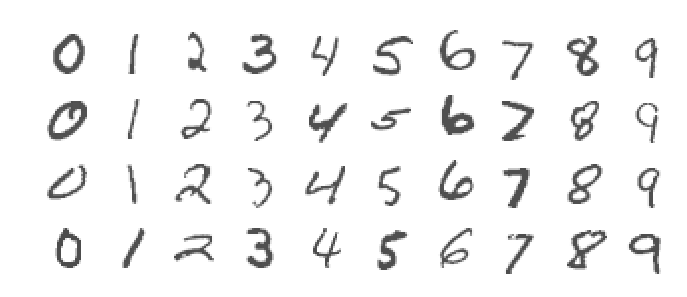
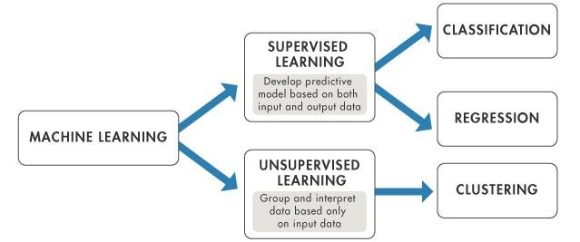
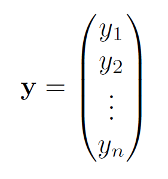
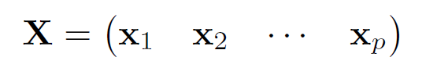

```{r setup, include=FALSE}
knitr::opts_chunk$set(echo = TRUE, warning = FALSE, message = FALSE)
```

```{r, include=FALSE}
library(tidyverse)
# library(ggformula)
# library(gridExtra)
library(ISLR2)
```

<style>
  .col2 {
    columns: 2 200px;         /* number of columns and width in pixels*/
    -webkit-columns: 2 200px; /* chrome, safari */
    -moz-columns: 2 200px;    /* firefox */
  }
  .col3 {
    columns: 3 100px;
    -webkit-columns: 3 100px;
    -moz-columns: 3 100px;
  }
</style>


## What is Machine Learning?

* Machine Learning is the study of tools/techniques for understanding complex datasets.

* The name machine learning was coined in 1959 by Arthur Samuel.

    + "Field of study that gives computers the ability to learn without being explicitly programmed."
    
    

## What is Machine Learning?

Tom M. Mitchell (1998) defined algorithms studied in the machine learning field as

"A computer program is said to learn from experience E with respect to some class of tasks T and performance measure P if its performance at tasks in T, as measured by P, improves with experience E."

<!-- ## But, Textbook is Not About Machine Learning??!!! -->

<!-- Statisticians focus on the statistical aspect of problems. -->

<!-- ```{r , echo=FALSE,  fig.align='center', fig.cap="Authors of ISL", out.width = '70%'} -->
<!--  -->
<!-- ``` -->


## <span style="color:blue">Question!!!</span>

Suppose your email program watches which emails you do or do not mark as spam, and based on that learns how to better filter spam. According to Tom Mitchell's definition, what is the task T, experience E, and performance measure P in this setting?

* The number (or fraction) of emails correctly classified as spam/ham.
* Classifying emails as spam or ham (not spam)
* Watching you label emails as spam or ham.


## <span style="color:blue">Question!!!</span>

Suppose you are interested in the problem of housing price prediction. You have collected a set of data on house prices at a city and want to use the house characteristics (square footage, number of bedrooms, etc.) to predict the price. 
\

According to Tom Mitchell's definition, what is the task T, experience E, and performance measure P in this setting?


## What is Machine Learning?

```{r , echo=FALSE,  fig.align='center', fig.cap="MNIST handwritten digits (from ISLR, James et al.)", out.width = '100%'}

```


## Statistical Learning vs Machine Learning vs Data Science

* Machine learning arose as a subfield of Artificial Intelligence.
* Statistical learning arose as a subfield of Statistics.
* There is much overlap, a great deal of "cross-fertilization".
* "Data Science" - Reflects the fact that both statistical and machine learning are about data.
* "Machine learning" or "Data Science" are "fancier" terms.


## Supervised vs Unsupervised

```{r , echo=FALSE,  fig.align='center', fig.cap="Machine Learning Tasks (from Bunker and Fayez, 2017)", out.width = '100%'}

```


<!-- ## Supervised Learning -->

<!-- * Labeled **training data** -->

<!-- * Inputs/Features/Regressors/Covariates/Independent Variables -->

<!-- $$ -->
<!-- \mathbf{X} = \begin{pmatrix}  -->
<!--     x_{11} & x_{12} & \dots & x_{1p} \\ -->
<!--     x_{21} & x_{22} & \dots & x_{2p} \\ -->
<!--     \vdots & \vdots &\ddots & \vdots \\ -->
<!--     x_{n1} & x_{n2} & \dots & x_{np} -->
<!--     \end{pmatrix} -->
<!-- $$ -->


<!-- ```{r , echo=FALSE,  fig.align='center', out.width = '40%'} -->
<!-- knitr::include_graphics("EFT/DataMatrix1.png") -->
<!-- ``` -->

<!-- * Response/Target/Dependent Variable -->

<!-- \[ -->
<!-- \mathbf{y} = \begin{pmatrix}  -->
<!--     y_{11} \\ -->
<!--     y_{21} \\ -->
<!--     \vdots \\ -->
<!--     y_{n1}  -->
<!--     \end{pmatrix} -->
<!-- \] -->

<!-- ```{r , echo=FALSE,  fig.align='center', out.width = '20%'} -->
<!--  -->
<!-- ``` -->


## Supervised Learning

* We have access to **labeled** data

* The objective is to learn the overall pattern of the relationship between the inputs ($\mathbf{X}$) and response ($Y$) in order to

    - Investigate the relationship between inputs and response.
    - Predict for potential unseen **test** cases.
    - Assess the quality of predictions.
\
\
\


Supervised Learning problems can be categorized into

* **Regression** problems (response is quantitative, continuous)
* **Classification** problems (response is qualitative, categorical)


## Unsupervised Learning

* No response/outcome variable, just $\mathbf{X}$.
* Understand structure within data.
    + find similar groups of observations based on features (**clustering**)
    + find a smaller subset of features with the most variation (**dimensionality reduction**)
* No gold-standard.
* Easier to collect unlabeled data.
* Useful pre-processing step for supervised learning.


## Terminologies/Notations  

* **Response/Target/Outcome** - variable we are interested in predicting, denoted as $Y$

* **Features/Inputs/Predictors** - variables used to predict the response, denoted as $X$

* **Feature Matrix** - all features taken together, denoted as $\mathbf{X}$

<!-- * Matrices - Bold, Upper-case $\mathbf{X}$ -->

<!-- * Vectors - Bold, Lower-case $\mathbf{x}$ -->

<!-- * Scalars - Normal, Lower-case $x$ -->

<!-- * Random Variables - Normal, Upper-case $X$ -->

* Number of data points/observations denoted as $n$

* Number of features/inputs/predictors denoted as $p$

* Missing entries in R are denoted as `NA`


<!-- ## Terminologies/Notations   -->

<!-- * **Ames Housing dataset** - Contains data on 881 houses in Ames, IA. We might be interested in predicting sale price. -->

<!-- The first ten observations are shown below. -->


<!-- ```{r, echo=FALSE} -->
<!-- ames <- readRDS("AmesHousing.rds") -->
<!-- ames <- ames %>% select(c(1,2,3,5,8,9)) -->
<!-- head(ames, 10) -->
<!-- ``` -->


<!-- ## Terminologies/Notations   -->

<!-- * **Default dataset** - Contains credit card default data on 10,000 individuals. We might be interested in predicting whether somebody will default or not. -->

<!-- The first ten observations are shown below. -->


<!-- ```{r, echo=FALSE} -->
<!-- set.seed(1) -->
<!-- data("Default") -->
<!-- Default <- Default[sample(1:10000, 10000),] -->
<!-- rownames(Default) <- 1:10000 -->
<!-- head(Default, 10) -->
<!-- ``` -->


<!-- * **US Arrests dataset** - Data on arrests for 50 US states. -->


<!-- ## Notations -->

<!-- $$ -->
<!-- \mathbf{X} = \begin{pmatrix}  -->
<!--     x_{11} & x_{12} & \dots & x_{1p} \\ -->
<!--     x_{21} & x_{22} & \dots & x_{2p} \\ -->
<!--     \vdots & \vdots &\ddots & \vdots \\ -->
<!--     x_{n1} & x_{n2} & \dots & x_{np} -->
<!--     \end{pmatrix} -->
<!-- $$ -->

<!-- ```{r , echo=FALSE,  fig.align='center', fig.cap="A matrix of dimension n x p", out.width = '40%'} -->
<!-- knitr::include_graphics("EFT/DataMatrix1.png") -->
<!-- ``` -->

<!-- \[ -->
<!-- \mathbf{y} = \begin{pmatrix}  -->
<!--     y_{11} \\ -->
<!--     y_{21} \\ -->
<!--     \vdots \\ -->
<!--     y_{n1}  -->
<!--     \end{pmatrix} -->
<!-- \] -->


<!-- ```{r , echo=FALSE,  fig.align='center', fig.cap="A n-dimensional vector", out.width = '15%'} -->
<!--  -->
<!-- ``` -->

<!-- \[ -->
<!-- \mathbf{X} = \begin{pmatrix}  -->
<!--     \mathbf{x}_{1} & \mathbf{x}_{2} & \dots & \mathbf{x}_{p} \\ -->
<!--        \end{pmatrix} -->
<!-- \] -->


<!-- ```{r , echo=FALSE,  fig.align='center', fig.cap="Matrix", out.width = '40%'} -->
<!--  -->
<!-- ``` -->

<!-- ## <span style="color:blue">Question!!!</span> -->

<!-- Suppose you are given the following feature matrix. -->

<!-- $$ -->
<!-- \mathbf{X}=\begin{pmatrix} -->
<!-- 8.5 & 11.2 & 7.0 & 9.3 \\ -->
<!-- 8.0 & 11.5 & 13.1 & 7.4 \\ -->
<!-- 6.4 & 9.6 & 7.0 & 6.8 \\ -->
<!-- 9.5 & -3.2 & 14.4 & 1.6 -->
<!-- \end{pmatrix} -->
<!-- $$ -->

<!-- For each of the **Ames Housing** and **Default** datasets, -->

<!-- * What are the corresponding values of $n$ and $p$? -->

<!-- * What will be the dimension of the corresponding response vector \(Y\)? -->

<!-- * What is the value of the 3rd feature for the 2nd observation? -->


## <span style="color:blue">Question!!!</span>

Suppose you have information about 867 cancer patients on their age, tumor size, clump thickness of the tumor, uniformity of cell size, and whether the tumor is malignant or benign. Based on these data, you are interested in building a model to predict the type of tumor (malignant or benign) for future cancer patients. 

* What are the values of $n$ and $p$ in this dataset?

* What are the inputs/features?


<!-- ## Unsupervised Learning -->

<!-- **US Arrests dataset** - Data on arrests for 50 US states. -->

<!-- The first ten observations are shown below. -->

<!-- ```{r, echo=FALSE} -->
<!-- data("USArrests") -->
<!-- head(USArrests, 10) -->
<!-- ``` -->


<!-- ## Supervised Learning -->

<!-- *Advertising* dataset -->

<!-- ```{r, echo=FALSE} -->
<!-- Advertising=read.csv("Advertising.csv") -->
<!-- Advertising$X=NULL -->
<!-- names(Advertising)=c("TV","Radio","Newspaper","Sales") -->
<!-- head(Advertising,15) -->
<!-- ``` -->

<!-- * Inputs - *TV*, *Radio*, *Newspaper* -->
<!-- * Response - *Sales* -->

<!-- ## Supervised Learning -->

<!-- ```{r , echo=FALSE,  fig.align='center', out.width = '100%'} -->
<!-- knitr::include_graphics("EFT/2.1.png") -->
<!-- ``` -->

<!-- Shown are *Sales* vs *TV*, *Radio* and *Newspaper*, with a blue straight line fit separately to each. Can we predict *Sales* using these three? -->

<!-- We could use a model -->
<!-- $$\text{Sales} \approx f(TV,Radio,Newspaper)$$ -->


## <span style="color:blue">Question!!!</span> {.smaller}

Some of the problems below are best addressed using a supervised learning algorithm, while others with an unsupervised learning algorithm. In each case, identify whether the problem belongs to the supervised or unsupervised learning paradigm. (Assume some appropriate dataset is available for your algorithm to "learn" from.)

* Examine the statistics of two football teams, and predict which team will win tomorrow's match (given historical data of teams' wins/losses to learn from).

* Given genetic (DNA) data from a person, predict the probability of the person developing diabetes over the next 10 years.

* Take a collection of 1000 essays written on the US economy, and find a way to automatically group these essays into a small number of groups of essays that are somehow "similar" or "related".

<!-- * Examine a large collection of emails that are known to be spam, to discover if there are sub-types of spam email. -->

<!-- * Suppose you have information about 867 cancer patients on their age, tumor size, clump thickness of the tumor, uniformity of cell size, and whether the tumor is malignant or benign. Based on these data, you are interested in building a model to predict the type of tumor (malignant or benign) for future cancer patients. -->

* Examine data on the income and years of education of adults in a neighborhood and build a model to predict the income from years of education.


