```{r setup, include=FALSE}
knitr::opts_chunk$set(echo = TRUE, warning = FALSE, message = FALSE)
```

```{r, include=FALSE}
library(tidyverse)
# library(ggformula)
# library(gridExtra)
library(ISLR2)
```

<style>
  .col2 {
    columns: 2 200px;         /* number of columns and width in pixels*/
    -webkit-columns: 2 200px; /* chrome, safari */
    -moz-columns: 2 200px;    /* firefox */
  }
  .col3 {
    columns: 3 100px;
    -webkit-columns: 3 100px;
    -moz-columns: 3 100px;
  }
</style>


## Supervised Learning

More mathematically, the "true"/population model can be represented by

$$Y=f(\mathbf{X}) + \epsilon$$

where $\epsilon$ is a **random** error term (includes measurement error, other discrepancies) independent of $\mathbf{X}$ and has mean zero.


<!-- ## Supervised Learning -->

<!-- **Income dataset** -->

<!-- ```{r , echo=FALSE,  fig.align='center', fig.cap = "Figure adapted from ISLR2", out.width = '100%'} -->
<!-- 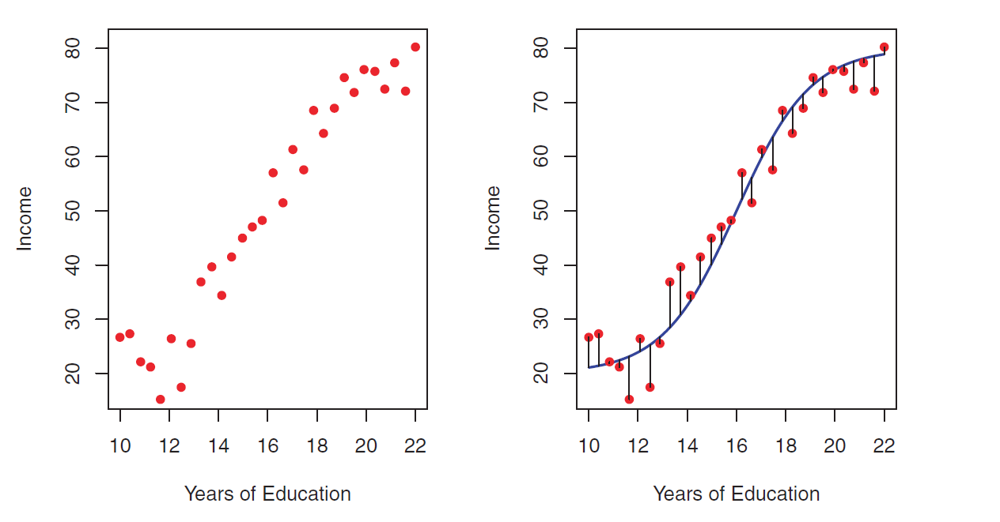 -->
<!-- ``` -->


<!-- ## Supervised Learning -->

<!-- The primary objective is to: -->

<!-- * **Regression**: response $Y$ is quantitative -->

<!-- Build a model $\hat{Y} = \hat{f}(\mathbf{X})$ -->

<!-- * **Classification**: response $Y$ is qualitative -->

<!-- Build a classifier $\hat{Y}=\hat{C}(\mathbf{X})$ -->


<!-- ## Supervised Learning -->

<!-- **Income dataset** -->

<!-- ```{r , echo=FALSE,  fig.align='center', fig.cap = "Observed vs 'True' Relationship (from ISLR2)", out.width = '100%'} -->
<!--  -->
<!-- ``` -->

<!-- ## Supervised Learning -->

<!-- **Income dataset** -->

<!-- ```{r , echo=FALSE,  fig.align='center', fig.cap = "Observed vs 'True' Relationship (from ISLR2)", out.width = '85%'} -->
<!-- 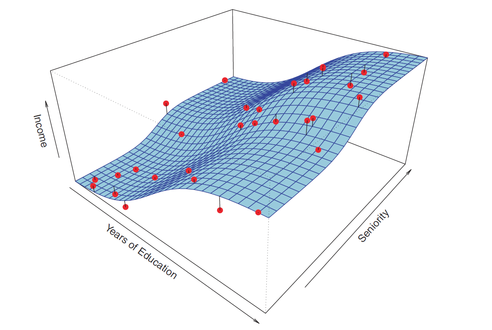 -->
<!-- ``` -->


## Supervised Learning: Why Estimate $f(\mathbf{X})$?

We wish to know about $f(\mathbf{X})$ for two reasons:

* Prediction at new unseen data points $x_0$

$$\hat{y}_0=\hat{f}(x_0) \ \ \ \text{or} \ \ \ \hat{y}_0=\hat{C}(x_0)$$

* Inference: Understand the relationship between $\mathbf{X}$ and $Y$.

* An ML algorithm that is developed mainly for predictive purposes is often termed as a **Black Box** algorithm.
\
\


The primary objective is to:

* **Regression** (response $Y$ is quantitative): Build a model $\hat{Y} = \hat{f}(\mathbf{X})$

* **Classification** (response $Y$ is qualitative): Build a classifier $\hat{Y}=\hat{C}(\mathbf{X})$


## Supervised Learning: Prediction and Inference

**Income dataset**

```{r , echo=FALSE,  fig.align='center', fig.cap = "Why ML? (from ISLR2)", out.width = '100%'}

```

<!-- ## Supervised Learning: Inference -->

<!-- ```{r , echo=FALSE,  fig.align='center', out.width = '100%'} -->
<!-- 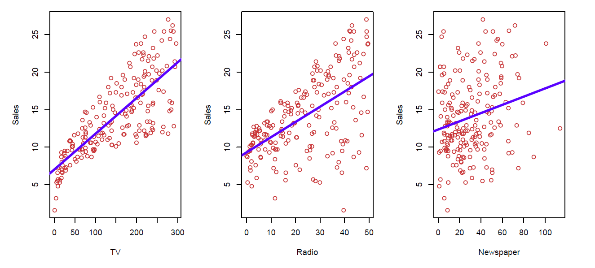 -->
<!-- ``` -->

## Supervised Learning: Prediction and Inference

**Income dataset**

```{r, fig.show = "hold", fig.cap="Why ML? (from ISLR2)", out.width = "50%", fig.align = "center", echo=FALSE}

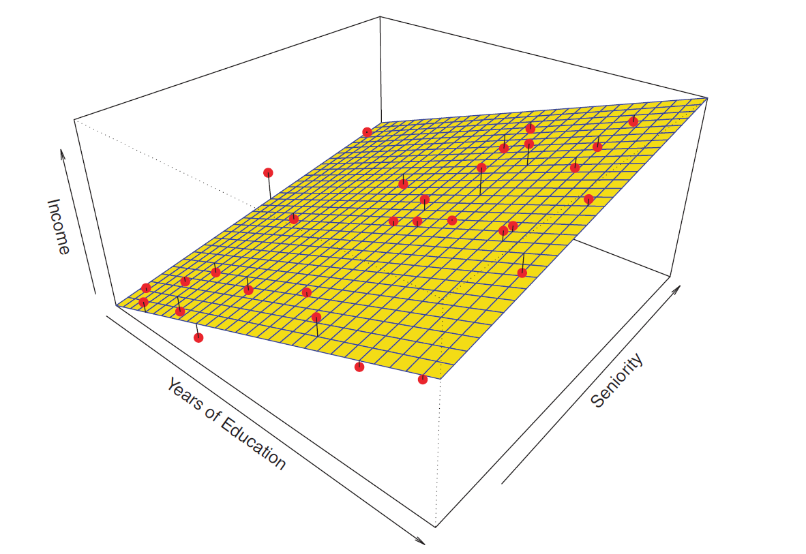
```

<!-- ```{r , echo=FALSE,  fig.align='center', fig.cap = "Why ML? (from ISLR2)", out.width = '85%'} -->
<!--  -->
<!-- ``` -->


<!-- ## <span style="color:blue">Question!!!</span>  -->

<!-- Which of the following statements are correct? -->

<!-- 1. As `Years of Education` increases, `Income` increases, keeping `Seniority` fixed. -->

<!-- 2. As `Years of Education` increases, `Income` decreases, keeping `Seniority` fixed. -->

<!-- 3. As `Years of Education` increases, `Income` increases. -->

<!-- 4. As `Seniority` increases, `Income` increases, keeping `Years of Education` fixed. -->

<!-- 5. As `Seniority` increases, `Income` decreases, keeping `Years of Education` fixed. -->

<!-- 6. As `Seniority` increases, `Income` increases. -->


<!-- ## <span style="color:blue">Question!!!</span>  -->

<!-- Which of the following statements are correct? -->

<!-- 1. The increase in `Income` resulting from increase in `Years of Education` keeping other variables fixed is **more** than the increase in `Income` resulting from increase in `Seniority` keeping other variables fixed. -->

<!-- 2. The increase in `Income` resulting from increase in `Years of Education` keeping other variables fixed is **less** than the increase in `Income` resulting from increase in `Seniority` keeping other variables fixed. -->


<!-- ## Supervised Learning: What is a Good Choice of $\hat{f}(\mathbf{X})$? -->

<!-- ```{r , echo=FALSE,  fig.align='center', out.width = '80%'} -->
<!-- knitr::include_graphics("EFT/SLfig.png") -->
<!-- ``` -->

<!-- What is a good value of $\hat{f}(\mathbf{X})$, say at $\mathbf{X}=x=4$? A possible value is -->

<!-- $$\hat{f}(\mathbf{X})=E(Y|\mathbf{X}=4)$$ -->

<!-- $E(Y|\mathbf{X}=4)$ means **expected value** (average) of $Y$ ate $\mathbf{X}=4$. -->


<!-- ## <span style="color:blue">Question!!!</span> -->

<!-- Which of the following statements are true for the random error term $\epsilon$ in the expression $Y=f(\mathbf{X})+\epsilon$? -->

<!-- * $\epsilon$ depends on $\mathbf{X}$ and has mean zero. -->

<!-- * $Var(\epsilon)$ is also known as the irreducible error. -->

<!-- * $\epsilon$ is independent of $\mathbf{X}$ and has mean zero. -->

<!-- * $\epsilon$ is some fixed but unknown function of $\mathbf{X}$. -->
  
  
## Supervised Learning: How Do We Estimate $f(\mathbf{X})$?

Broadly speaking, we have two approaches.

* Parametric and Structured Methods
    + A functional form of $f(\mathbf{X})$ is assumed, such as $$f(\mathbf{X})=\beta_0 + \beta_1 \mathbf{x}_1 + \beta_2 \mathbf{x}_2 + \ldots + \beta_p \mathbf{x}_p$$
    + We estimate the parameters $\beta_0, \beta_1, \ldots, \beta_p$ by fitting the model to labeled training data.


<!-- ## Supervised Learning: Parametric Methods -->

<!-- **Income dataset** -->

<!-- ```{r , echo=FALSE,  fig.align='center', fig.cap="Parametric model fit (from ISLR2)", out.width = '90%'} -->
<!--  -->
<!-- ``` -->

<!-- $$\text{Income} \approx \beta_0 + \beta_1 \times \text{Years of Education}$$ -->


## Supervised Learning: Parametric Methods

**Income dataset**

```{r, fig.show = "hold", fig.cap="Parametric model fit (from ISLR2)", out.width = "50%", fig.align = "center", echo=FALSE}


```

$$\text{Income} \approx \beta_0 + \beta_1 \times \text{Years of Education} + \beta_2 \times \text{Seniority}$$


## Supervised Learning: Non-parametric Methods

Non-parametric approaches do not make any explicit assumptions about the functional form of $f(\mathbf{X})$. A very large number of observations (compared to a parametric approach) is required to fit a model using the non-parametric approach.

**Income dataset**

```{r fig2, fig.show = "hold", fig.cap="Non-parametric model fit (from ISLR2)", out.width = "50%", fig.align = "center", echo=FALSE}

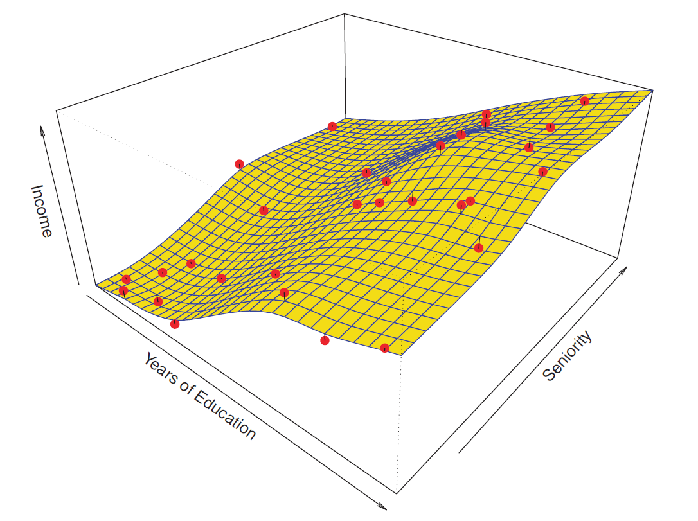
```


## Supervised Learning: Flexibility of Models

Flexibility refers to the smoothness of functions. (More theoretically, flexibility depends on the number of parameters of the function).


<!-- ```{r,echo=FALSE} -->
<!-- set.seed(208) -->

<!-- # simulate data -->
<!-- x <- runif(n = 100, min = 20, max = 40)   # input/predictor -->

<!-- e <- rnorm(n = 100, mean = 0, sd = 1)  # error -->

<!-- a <- 3 -->
<!-- b <- 0.87 -->
<!-- c <- 0.5 -->
<!-- fx <- a + (b * sqrt(x)) + (c * sin(x))   # true function -->

<!-- y <- fx + e    # observed responses -->

<!-- toy_data <- data.frame(input = x, true_form = fx, response = y)   # create data frame to store values -->
<!-- ``` -->


<!-- ```{r, fig.align='center', fig.width=8, fig.height=6, echo=FALSE} -->
<!-- # plot input and true function -->
<!-- g1 <- ggplot(data = toy_data, aes(x = input, y = true_form)) + -->
<!--   geom_point() + labs(title = "True relationship without error", y = "f(x)", x = "x") -->

<!-- # plot input and observed response -->
<!-- g2 <- ggplot(data = toy_data, aes(x = input, y = response)) + -->
<!--   geom_point() + labs(title = "Observed relationship", y = "y", x = "x") -->

<!-- # plot linear model (red) and non-linear model (blue) -->
<!-- g3 <- ggplot(data = toy_data, aes(x = input, y = response)) + -->
<!--   geom_point() + -->
<!--   geom_function(fun = function(x) a+(b*sqrt(x))+(c*sin(x)), aes(color = "true model"), linewidth = 1.5) + -->
<!--   geom_smooth(method = "lm", se = FALSE, aes(color = "linear model")) + -->
<!--   geom_smooth(formula = y ~ sqrt(x) + sin(x), se = FALSE, aes(color = "non-linear model")) + -->
<!--   scale_color_manual(values = c("true model" = "red", "linear model" = "blue", "non-linear model" = "green")) + -->
<!--   theme(legend.title = element_blank()) + -->
<!--   labs(title = "Comparing two models", y = "y", x = "x") -->

<!-- # library(ggpubr) -->
<!-- # ggarrange(g1, g2, ncol = 2, nrow = 2, align = "none") -->
<!-- ``` -->


<!-- <!-- ## Supervised Learning: Flexibility of Models --> 

<!-- ```{r, echo=FALSE, fig.align='center', fig.width=10, fig.height=4} -->
<!-- g3 -->
<!-- ``` -->


<!-- ```{r , echo=FALSE,  fig.align='center', fig.cap = "Comp (from ISLR2)", out.width = '80%'} -->
<!--  -->
<!-- ``` -->

More flexible $\implies$ More complex $\implies$ Less Smooth $\implies$ Less Restrictive $\implies$ Less Interpretable


## Supervised Learning: Some Trade-offs

* Prediction Accuracy versus Interpretability

* Good Fit versus Over-fit or Under-fit


## Supervised Learning: Some Trade-offs

```{r , echo=FALSE,  fig.align='center', fig.cap = "Trade-off between flexibility and interpretability (from ISLR2)", out.width = '100%'}
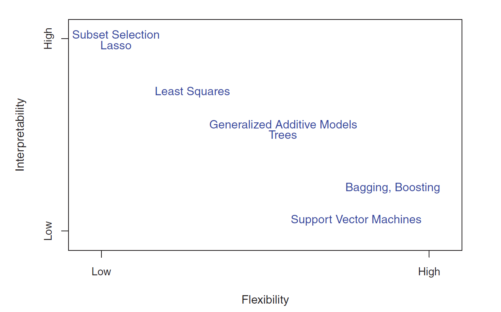
```


## Supervised Learning: Assessing Model Accuracy

Why are we going to study so many different ML techniques?

**There is no free lunch in statistics**: No one method dominates all others over all possible datasets.
\
\


<!-- ## Supervised Learning: Prediction -->

When we estimate $f(\mathbf{X})$ using $\hat{f}(\mathbf{X})$, then,

$$E\left[Y-\hat{Y}\right]^2=E\left[f(\mathbf{X})+\epsilon - \hat{f}(\mathbf{X})\right]^2=\underbrace{\left[f(\mathbf{X})-\hat{f}(\mathbf{X})\right]^2}_{Reducible} + \underbrace{Var(\epsilon)}_{Irreducible}$$

$E\left[Y-\hat{Y}\right]^2$: Expected (average) squared difference between predicted and actual (observed) response.

We will focus on techniques for estimating $f(\mathbf{X})$ with the objective of minimizing the reducible error.


## Supervised Learning: Assessing Model Accuracy

Suppose we have labeled training data $(x_1,y_1), (x_2, y_2), \ldots, (x_n,y_n)$, i.e, $n$ training data points/observations.

We fit/train a model $\hat{y}=\hat{f}(x)$ (or, a classifier $\hat{y}=\hat{C}(x)$) on the training data and obtain estimates $\hat{f}(x_1), \hat{f}(x_2), \ldots, \hat{f}(x_n)$ (or, $\hat{C}(x_1), \hat{C}(x_2), \ldots, \hat{C}(x_n)$).

We could then compute the

* **Regression**

$$\text{Training MSE}=\text{Average}_{Training} \left(y-\hat{f}(x)\right)^2 = \frac{1}{n} \displaystyle \sum_{i=1}^{n} \left(y_i-\hat{f}(x_i)\right)^2$$


* **Classification**

$$\text{Training Error Rate}=\text{Average}_{Training} \ \left[I \left(y\ne\hat{C}(x)\right) \right]= \frac{1}{n} \displaystyle \sum_{i=1}^{n} \ I\left(y_i \ne \hat{C}(x_i)\right)$$


## Supervised Learning: Assessing Model Accuracy

But in general, we are not interested in how the method works on the training data. We want to measure the accuracy of the method on previously unseen test data.

Suppose, if possible, we have fresh test data, $(x_1^{test},y_1^{test}), (x_2^{test},y_2^{test}), \ldots, (x_m^{test},y_m^{test})$. Then we can compute,

* **Regression**

$$\text{Test MSE}=\text{Average}_{Test} \left(y-\hat{f}(x)\right)^2 = \frac{1}{m} \displaystyle \sum_{i=1}^{m} \left(y_i^{test}-\hat{f}(x_i^{test})\right)^2$$


* **Classification**

$$\text{Test Error Rate}=\text{Average}_{Test} \ \left[I \left(y\ne\hat{C}(x)\right) \right]= \frac{1}{m} \displaystyle \sum_{i=1}^{m} \ I\left(y_i^{test} \ne \hat{C}(x_i^{test})\right)$$


## Supervised Learning: Bias-Variance Trade-off

<!-- Why is the Test MSE U-shaped? -->

Suppose we have fit a model $\hat{f}(x)$ to some training data. Let the "true" model be $Y=f(x)+\epsilon$. Let $(x_0, y_0)$ be a test observation.

We have,

$$\underbrace{\text{Average}_{Test}\left(y_0-\hat{f}(x_0)\right)^2}_{total \ error}=\underbrace{Var\left(\hat{f}(x_0)\right)}_{source \ 3} + \underbrace{\left[Bias\left(\hat{f}(x_0)\right)\right]^2}_{source \ 2}+\underbrace{Var(\epsilon)}_{source \ 1}$$

where $Bias\left(\hat{f}(x_0)\right)=E\left(\hat{f}(x_0)\right)-f(x_0)$

<!-- ## Supervised Learning: Bias-Variance Trade-off -->

* source 1: how $y$ differs from "true" $f(x)$

* source 2: how $\hat{f}(x)$ (when fitted to the test data) differs from $f(x)$

* source 3: how $\hat{f}(x)$ varies among different randomly selected possible training data


<!-- ## Supervised Learning: Comparing Bias -->

<!-- ```{r, echo=FALSE} -->
<!-- set.seed(55) -->

<!-- # simulate data -->
<!-- x <- runif(n = 100, min = 20, max = 40)  # input/predictor  -->

<!-- e <- rnorm(n = 100, mean = 0, sd = 1)   # error -->

<!-- a <- 3 -->
<!-- b <- 0.87 -->
<!-- c <- 0.5 -->
<!-- fx <- a + (b * sqrt(x)) + (c * sin(x))   # true function -->

<!-- y <- fx + e  # observed responses -->

<!-- toy_data <- data.frame(input = x, response = y)   # create data frame to store values -->
<!-- ``` -->


<!-- ```{r, fig.align='center', fig.width=8, fig.height=6, warning=FALSE, message=FALSE, echo=FALSE} -->
<!-- # compare the bias between two fits: linear (bold) and curved (dashed), true function is in black -->
<!-- ggplot(data = toy_data, aes(x = input, y = response)) +  -->
<!--   geom_point() +  -->
<!--   geom_function(fun = function(x) a+(b*sqrt(x))+(c*sin(x)), aes(color = "true model"), linewidth = 1) + -->
<!--   geom_smooth(method = "lm", se = FALSE) +  -->
<!--   geom_smooth(formula = y ~ sqrt(x) + sin(x), linetype = "dashed", se = FALSE) + -->
<!--   scale_color_manual(values = c("true model" = "red")) + -->
<!--   theme(legend.title = element_blank()) + -->
<!--   labs(title = "Comparison of bias between two models", y = "y", x = "x") -->
<!-- ``` -->


<!-- ## Supervised Learning: Comparing Variance -->

<!-- ```{r, echo=FALSE} -->
<!-- set.seed(55) -->

<!-- # first training data -->
<!-- x1 <- runif(n = 100, min = 20, max = 40) -->
<!-- e1 <- rnorm(n = 100, mean = 0, sd = 0.5) -->
<!-- fx1 <- 3 + (0.87*sqrt(x1)) + (0.5*sin(x1)) -->
<!-- y1 <- fx1 + e1 -->

<!-- # second training data -->
<!-- x2 <- runif(n = 100, min = 20, max = 40) -->
<!-- e2 <- rnorm(n = 100, mean = 0, sd = 0.5) -->
<!-- fx2 <- 3 + (0.87*sqrt(x2)) + (0.5*sin(x2)) -->
<!-- y2 <- fx2 + e2 -->

<!-- # third training data -->
<!-- x3 <- runif(n = 100, min = 20, max = 40) -->
<!-- e3 <- rnorm(n = 100, mean = 0, sd = 0.5) -->
<!-- fx3 <- 3 + (0.87*sqrt(x3)) + (0.5*sin(x3)) -->
<!-- y3 <- fx3 + e3 -->

<!-- dat <- data.frame(x1 = x1, y1 = y1, x2 = x2, y2 = y2, x3 = x3, y3 = y3) -->
<!-- ``` -->


<!-- ```{r, fig.align='center', fig.width=10, fig.height=6, echo=FALSE, warning=FALSE, message=FALSE} -->
<!-- # comparison of variance within the linear fits from three different datasets (true function is in black) -->
<!-- g_linear <- ggplot(data = dat) +  -->
<!--   geom_function(fun = function(x) 3+(0.87*sqrt(x))+(0.5*sin(x)), aes(color = "true model"), linewidth = 1) + -->
<!--   geom_smooth(aes(x=x1, y=y1), method = "lm", se = FALSE) +  -->
<!--   geom_smooth(aes(x=x2, y=y2), method = "lm", se = FALSE, linetype = "dashed") + -->
<!--   geom_smooth(aes(x=x3, y=y3), method = "lm", se = FALSE, linetype = "dotted") + -->
<!--   labs(x="x", y="y") + -->
<!--   scale_color_manual(values = c("true model" = "red")) + -->
<!--   theme(legend.title = element_blank()) + -->
<!--   labs(title = "Linear fit", y = "y", x = "x") -->

<!-- # comparison of variance within the non-linear fits from three different datasets (true function is in black) -->
<!-- g_curved <- ggplot(data = dat) +  -->
<!--   geom_function(fun = function(x) 3+(0.87*sqrt(x))+(0.5*sin(x)), aes(color = "true model"), linewidth = 1) + -->
<!--   geom_smooth(aes(x=x1, y=y1), formula = y ~ sqrt(x) + sin(x), se = FALSE) + -->
<!--   geom_smooth(aes(x=x2, y=y2), formula = y ~ sqrt(x) + sin(x), linetype = "dashed", se = FALSE) + -->
<!--   geom_smooth(aes(x=x3, y=y3), formula = y ~ sqrt(x) + sin(x), linetype = "dotted", se = FALSE) + -->
<!--   labs(x="x", y="y") + -->
<!--   scale_color_manual(values = c("true model" = "red")) + -->
<!--   theme(legend.title = element_blank()) + -->
<!--   labs(title = "Non-linear fit", y = "y", x = "x") -->

<!-- g_both <- ggarrange(g_linear, g_curved, ncol = 2, common.legend = TRUE, legend="bottom") -->
<!-- annotate_figure(g_both, top = text_grob("Comparison of variance between two models", face = "bold", size = 14)) -->
<!-- ``` -->


## Bias-Variance Trade-off


```{r , echo=FALSE,  fig.align='center', out.width = '40%', fig.cap="Figure from ISLR2"}
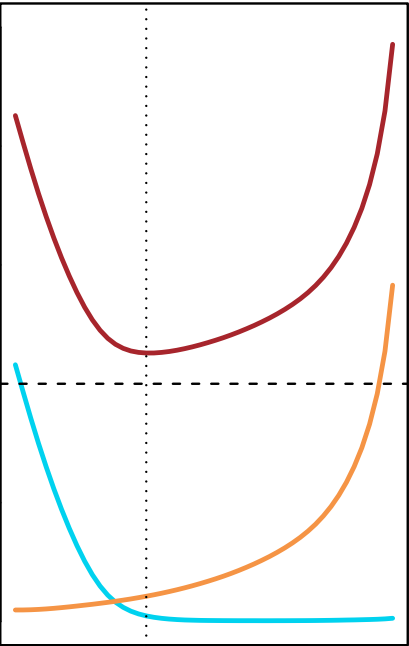
```


<!-- ## Supervised Learning: Comparing Bias and Variance -->


<!-- ## Bias-Variance Trade-off: Example -->

<!-- In the following slides, we look at three different examples with simulated toy datasets. We work within the regression setting (but the ideas also extend to the classification setting) and three different $\hat{f}(.)$'s. -->

<!-- * Linear Regression (<span style="color:orange">**orange**</span>) -->
<!-- * Smoothing Spline 1 (<span style="color:blue">**blue**</span>) -->
<!-- * More flexible Smoothing Spline 2 (<span style="color:green">**green**</span>) -->

<!-- The "true" function (simulated) is $f(.)$ (<span style="color:black">**black**</span>). -->


<!-- ## Bias-Variance Trade-off: Example -->

<!-- **Simulated toy dataset** -->

<!-- ```{r , echo=FALSE,  fig.align='center', out.width = '100%', fig.cap="Figure from ISLR2"} -->
<!-- 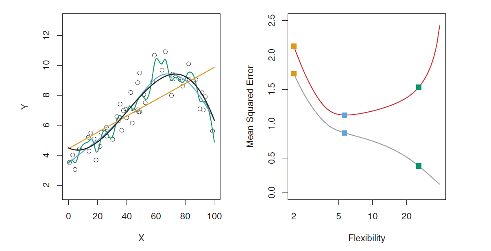 -->
<!-- ``` -->


<!-- ## Bias-Variance Trade-off: Example -->

<!-- **Simulated toy dataset** -->

<!-- ```{r , echo=FALSE,  fig.align='center', out.width = '100%', fig.cap="Figure from ISLR2"} -->
<!-- 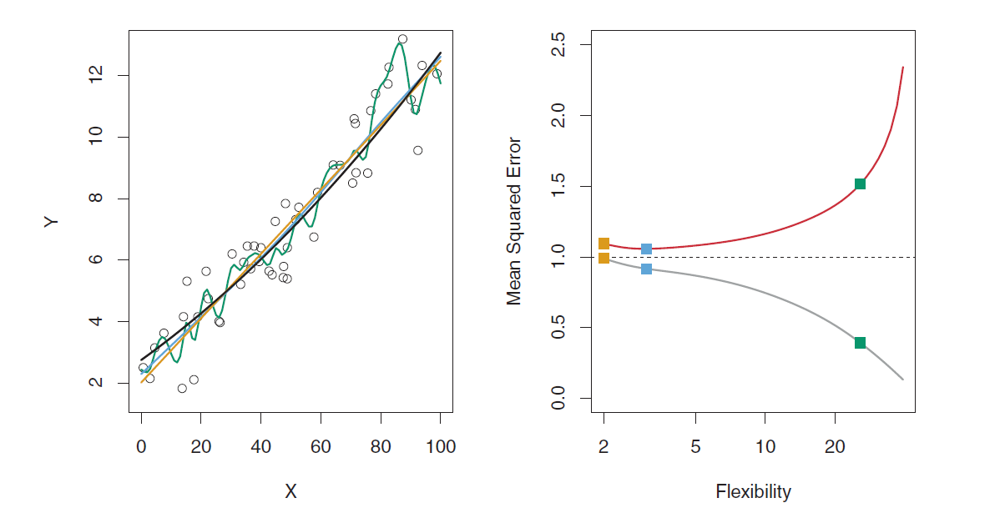 -->
<!-- ``` -->


<!-- ## Bias-Variance Trade-off: Example -->

<!-- **Simulated toy dataset** -->

<!-- ```{r , echo=FALSE,  fig.align='center', out.width = '100%', fig.cap="Figure from ISLR2"} -->
<!-- 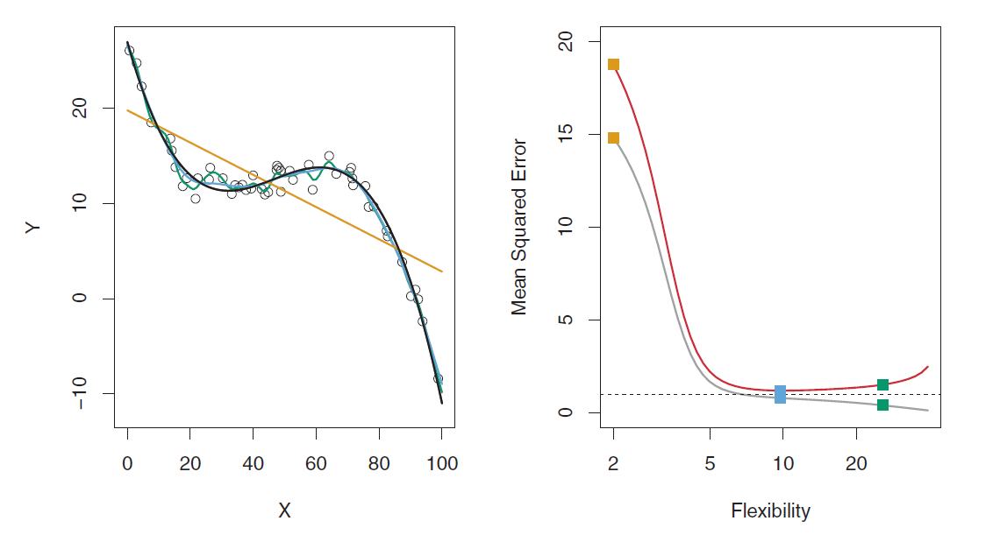 -->
<!-- ``` -->


<!-- ## Bias-Variance Trade-off: Example -->


<!-- ```{r , echo=FALSE,  fig.align='center', out.width = '100%', fig.cap="Figure from ISLR2"} -->
<!-- 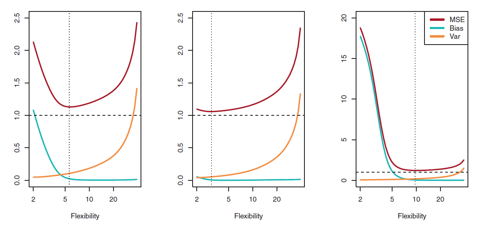 -->
<!-- ``` -->


## <span style="color:blue">Question!!!</span>

As the flexibility of a model $\hat{f}(\mathbf{X})$ increases,

1. its variance $\underline{\hspace{5cm}}$ (increases/decreases)

2. its bias $\underline{\hspace{5cm}}$ (increases/decreases)

3. its training MSE $\underline{\hspace{5cm}}$ (increases/decreases)

4. its test MSE $\underline{\hspace{5cm}}$ (increases/decreases/U-shaped)


## Linear Regression

Mathematically, a supervised learning problem can be represented by

$$Y=f(\mathbf{X}) + \epsilon$$

where $\epsilon$ is a **random** error term (includes measurement error, other discrepancies) independent of $\mathbf{X}$ and has mean zero.

**Objective**: To approximate/estimate $f(\mathbf{X})$

For linear regression, we assume that $f(\mathbf{X})$ is a linear function of $\mathbf{X}$, that is, for $p=1$

$$f(\mathbf{X}) = \beta_0 + \beta_1 X_1$$


## Linear Regression: Example

Suppose the CEO of a restaurant franchise is considering opening new outlets in different cities. They would like to expand their business to cities that give them higher profits with the assumption that highly populated cities will probably yield higher profits. 

They have data on the population (in 100,000) and profit (in $1,000) at 97 cities where they currently have outlets.

The first ten observations of the dataset are shown below.

```{r, echo = FALSE}
outlets <- readRDS("datasets/outlets.rds")   # load dataset

head(outlets, 10)   # first ten observations of the dataset
```


## Linear Regression

Given this dataset, our **objective** is to estimate $\beta_0$ and  $\beta_1$.


If we are able to estimate $\beta_0$ and  $\beta_1$, we can

* predict the profit for a new city with a given population,

* understand the relationship between `population` and `profit` better.


## Linear Regression: Example

Some Exploratory Data Analysis (EDA)

```{r, fig.align='center', fig.width=8, fig.height=6, echo = FALSE}
library(GGally)

ggpairs(data = outlets)
```


## Linear Regression: Estimating Parameters

We use training data to find $b_0$ and $b_1$ such that

$$\hat{y}=b_0 + b_1 \ x$$
Observed response: $y_i$ for $i=1,\ldots,n$

Predicted response: $\hat{y}_i$ for $i=1, \ldots, n$

Residual: $e_i = \hat{y}_i - y_i$ for $i=1, \ldots, n$

Mean Squared Error (MSE): $MSE =\dfrac{e^2_1+e^2_2+\ldots+e^2_n}{n}$  also known as the **loss/cost function**

Problem: Find $b_0$ and $b_1$ which minimizes $MSE$


<!-- ## Linear Regression: Estimating Parameters -->

<!-- A scatterplot of the dataset -->

<!-- ```{r, fig.align='center', fig.width=8, fig.height=6} -->
<!-- ggplot(data = outlets) + -->
<!--   geom_point(mapping = aes(x = population, y = profit)) -->
<!-- ``` -->


## Gradient Descent Algorithm

How do we minimize the $MSE$?

One optimization technique we can use is called the **gradient descent**. 


**NOTE**: Gradient Descent is not a machine learning technique. It is an optimization technique that helps to build machine learning models.


## Gradient Descent Algorithm

```{r, fig.align='center', fig.width=8, fig.height=6, echo=FALSE}
x <- seq(-5, 5, by = .01)
y <- x^2 + 3
df <- data.frame(x, y)

# plot
ggplot(df, aes(x, y)) +
  geom_line(size = 1.5, alpha = .5) +
  theme_classic() +
  scale_y_continuous("Cost/Loss function of the variable", limits = c(0, 30)) +
  xlab("variable") 
```

Updates to the variable:

$$\text{new value of variable} = \text{old value of variable} - \big(\text{step size} \times \text{gradient of function with respect to variable}\big)$$

## Gradient Descent Algorithm

```{r, fig.align='center', fig.width=8, fig.height=6, echo=FALSE}

# create data to plot
x <- seq(-5, 5, by = .05)
y <- x^2 + 3
df <- data.frame(x, y)
step <- 5
step_size <- .2
for(i in seq_len(18)) {
  next_step <- max(step) + round(diff(range(max(step), which.min(df$y))) * step_size, 0)
  step <- c(step, next_step)
  next
}
steps <- df[step, ] %>%
  mutate(x2 = lag(x), y2 = lag(y)) %>%
  dplyr::slice(1:18)
# plot
ggplot(df, aes(x, y)) +
  geom_line(size = 1.5, alpha = .5) +
  theme_classic() +
  scale_y_continuous("Cost/Loss function of the variable", limits = c(0, 30)) +
  xlab("variable") +
  geom_segment(data = df[c(5, which.min(df$y)), ], aes(x = x, y = y, xend = x, yend = -Inf), lty = "dashed") +
  geom_point(data = filter(df, y == min(y)), aes(x, y), size = 4, shape = 21, fill = "yellow") +
  geom_point(data = steps, aes(x, y), size = 3, shape = 21, fill = "blue", alpha = .5) +
  geom_curve(data = steps[-1,], aes(x = x, y = y, xend = x2, yend = y2), curvature = 1, lty = "dotted") +
  theme(
    axis.ticks = element_blank(),
    axis.text = element_blank()
  ) +
  annotate("text", x = df[5, "x"], y = 1, label = "initial value", hjust = -0.1, vjust = .8) +
  annotate("text", x = df[which.min(df$y), "x"], y = 1, label = "minimium", hjust = -0.1, vjust = .8) +
  annotate("text", x = df[5, "x"], y = df[5, "y"], label = "learning rate (step size)", hjust = -.8, vjust = 0)
```


## Gradient Descent Algorithm

```{r, fig.align='center', fig.width=10, fig.height=6, echo=FALSE}
# create too small of a learning rate
step <- 5
step_size <- .05
for(i in seq_len(10)) {
  next_step <- max(step) + round(diff(range(max(step), which.min(df$y))) * step_size, 0)
  step <- c(step, next_step)
  next
}
too_small <- df[step, ] %>%
  mutate(x2 = lag(x), y2 = lag(y))

# plot
p1 <- ggplot(df, aes(x, y)) +
  geom_line(size = 1.5, alpha = .5) +
  theme_classic() +
  scale_y_continuous("Cost/Loss function of the variable", limits = c(0, 30)) +
  xlab("variable") +
  geom_segment(data = too_small[1, ], aes(x = x, y = y, xend = x, yend = -Inf), lty = "dashed") +
  geom_point(data = too_small, aes(x, y), size = 3, shape = 21, fill = "blue", alpha = .5) +
  geom_curve(data = too_small[-1, ], aes(x = x, y = y, xend = x2, yend = y2), curvature = 1, lty = "dotted") +
  theme(
    axis.ticks = element_blank(),
    axis.text = element_blank()
  ) +
  annotate("text", x = df[5, "x"], y = 1, label = "initial value", hjust = -0.1, vjust = .8) +
  ggtitle("b) step size too small")


# create too large of a learning rate
too_large <- df[round(which.min(df$y) * (1 + c(-.9, -.6, -.2, .3)), 0), ] %>%
  mutate(x2 = lag(x), y2 = lag(y))

# plot
p2 <- ggplot(df, aes(x, y)) +
  geom_line(size = 1.5, alpha = .5) +
  theme_classic() +
  scale_y_continuous("Cost/Loss function of the variable", limits = c(0, 30)) +
  xlab("variable") +
  geom_segment(data = too_large[1, ], aes(x = x, y = y, xend = x, yend = -Inf), lty = "dashed") +
  geom_point(data = too_large, aes(x, y), size = 3, shape = 21, fill = "blue", alpha = .5) +
  geom_curve(data = too_large[-1, ], aes(x = x, y = y, xend = x2, yend = y2), curvature = 1, lty = "dotted") +
  theme(
    axis.ticks = element_blank(),
    axis.text = element_blank()
  ) +
  annotate("text", x = too_large[1, "x"], y = 1, label = "initial value", hjust = -0.1, vjust = .8) +
  ggtitle("a) step size too big")

gridExtra::grid.arrange(p2, p1, nrow = 1)

```


## Gradient Descent for Linear Regression

**Objective**: We want to find $b_0$ and $b_1$ which minimizes 

$$MSE = \dfrac{e^2_1+e^2_2+\ldots+e^2_n}{n} = \dfrac{(\hat{y}_1 - y_1)^2 +  (\hat{y}_2 - y_2)^2 + \ldots + (\hat{y}_n - y_n)^2}{n}$$
\
\


$$MSE = \dfrac{(b_0 + b_1 \ x_1 - y_1)^2 +  (b_0 + b_1 \ x_2 - y_2)^2 + \ldots + (b_0 + b_1 \ x_n - y_n)^2}{n}$$
\
\


$$MSE = \displaystyle \dfrac{1}{n}\sum_{i=1}^{n} (b_0 + b_1 \ x_i - y_i)^2 = \displaystyle \dfrac{1}{n}\sum_{i=1}^{n} (\hat{y}_i - y_i)^2 = \displaystyle \dfrac{1}{n}\sum_{i=1}^{n} (e_i)^2$$


## Gradient Descent for Linear Regression

To minimize $MSE$ with respect to $b_0$ and $b_1$, we need the derivatives/gradients of $MSE$ with respect to $b_0$ and $b_1$.


$$\text{gradient of MSE with respect to} \ b_0 = \dfrac{2}{n} \displaystyle \sum_{i=1}^{n} (b_0 + b_1 \ x_i - y_i) = \dfrac{2}{n} \displaystyle \sum_{i=1}^{n} (\hat{y}_i - y_i)$$
\
\
\


$$\text{gradient of MSE with respect to} \ b_1 = \dfrac{2}{n} \displaystyle \sum_{i=1}^{n} x_i (b_0 + b_1 \ x_i - y_i) = \dfrac{2}{n} \displaystyle \sum_{i=1}^{n} x_i (\hat{y}_i - y_i)$$


## Gradient Descent for Linear Regression

The gradient descent updates will be as follows:

* For $b_0$

$$b_0 \ \text{(new)} = b_0 \ \text{(old)}- \bigg(\text{step size} \times \text{gradient with respect to} \ b_0\bigg)$$
$$b_0 \ \text{(new)} = b_0 \ \text{(old)}- \bigg(\text{step size} \times \dfrac{2}{n} \displaystyle \sum_{i=1}^{n} (\hat{y}_i - y_i)\bigg)$$
\
\
\

* For $b_1$

$$b_1  \ \text{(new)} = b_1  \ \text{(old)} - \bigg(\text{step size} \times \text{gradient with respect to} \ b_1 \bigg)$$

$$b_1  \ \text{(new)} = b_1  \ \text{(old)} - \bigg(\text{step size} \times \dfrac{2}{n} \displaystyle \sum_{i=1}^{n} x_i (\hat{y}_i - y_i)\bigg)$$


Let's now implement this algorithm in R.


<!-- ## Linear Regression in R -->

<!-- ```{r} -->
<!-- outlets_model <- lm(profit ~ population, data = outlets) -->

<!-- outlets_model -->
<!-- ``` -->


<!-- ## Linear Regression in R -->

<!-- ```{r, fig.align='center', fig.width=8, fig.height=6, echo=FALSE} -->
<!-- ggplot(data = outlets) + -->
<!--   geom_point(mapping = aes(x = population, y = profit)) +    # create scatterplot -->
<!--   geom_smooth(mapping = aes(x = population, y = profit), method = "lm", se = FALSE)   # add the regression line -->
<!-- ``` -->


<!-- ## Linear Regression in R: Prediction -->

<!-- ```{r} -->
<!-- predict(outlets_model, newdata = data.frame(population = 17)) -->
<!-- ``` -->


