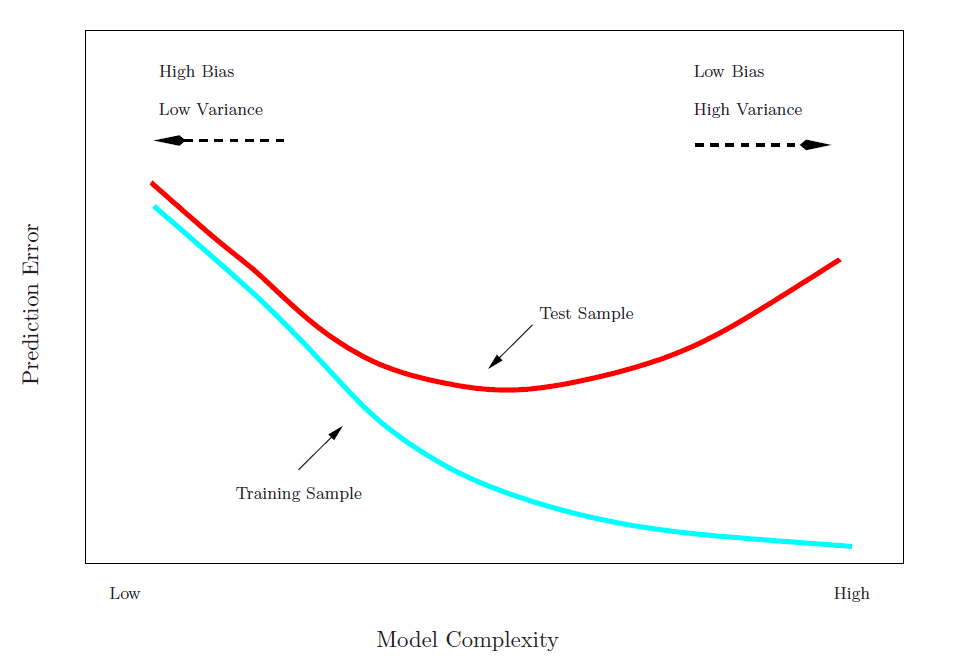
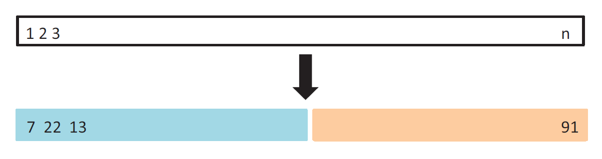
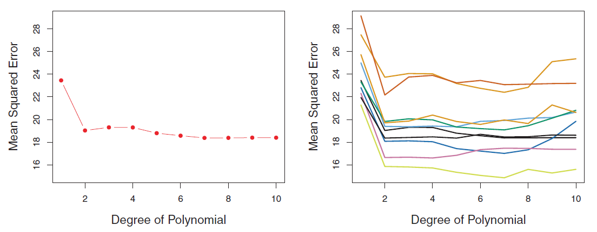
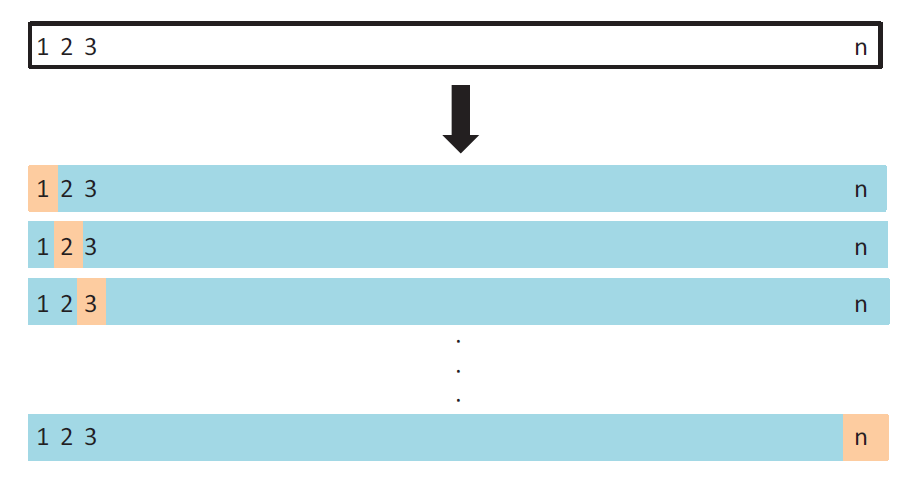
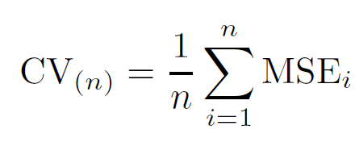
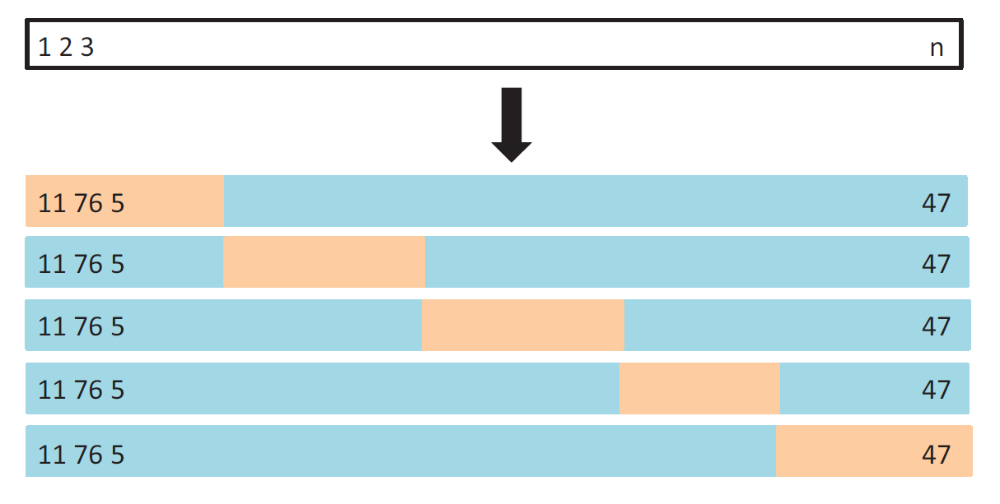
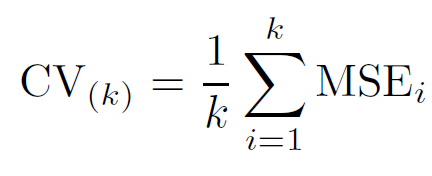
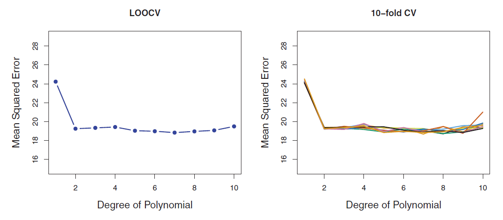
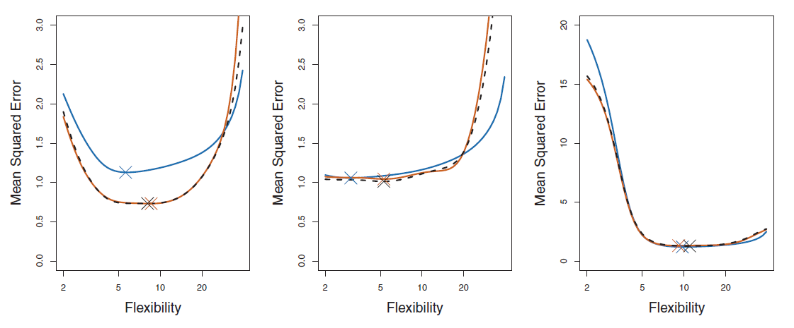

```{r setup, include=FALSE}
knitr::opts_chunk$set(echo = TRUE, warning = FALSE, message = FALSE)
```

```{r, include=FALSE}
library(tidyverse)
# library(ggformula)
# library(gridExtra)
library(ISLR2)
```

<style>
  .col2 {
    columns: 2 200px;         /* number of columns and width in pixels*/
    -webkit-columns: 2 200px; /* chrome, safari */
    -moz-columns: 2 200px;    /* firefox */
  }
  .col3 {
    columns: 3 100px;
    -webkit-columns: 3 100px;
    -moz-columns: 3 100px;
  }
</style>


## The Machine Learning Process

For the next 2-3 class periods, we are going to discuss the overall ML process. Note that, the procedures we will discuss are not ML models, rather the models go through this process to obtain the best (optimal) predictive model.


* Identify the task.

* Split the data into (typically) training and test datasets.

* Perform EDA (Exploratory Data Analysis) on the training set.

* Perform feature engineering.

* Perform CV for hyperparameter tuning and model selection. Choose the optimal model.

* Create the final model using the overall training data and estimate its performance on the test data.


<!-- **Ames Housing dataset** -->

<!-- ```{r,message=FALSE} -->
<!-- ames <- readRDS("AmesHousing.rds")   # load dataset -->
<!-- ``` -->

<!-- ```{r} -->
<!-- # we won't use the entire dataset now (that's for later) -->
<!-- # select the variables to work with for this class (04/18) -->

<!-- ames <- ames %>% select(Sale_Price, Garage_Area, Year_Built)  -->
<!-- ``` -->


<!-- ## Exploratory Data Analysis -->

<!-- **Ames Housing dataset** -->

<!-- ```{r} -->
<!-- summary(ames)   # summary of the variables -->
<!-- ``` -->


<!-- ## Exploratory Data Analysis -->

<!-- **Ames Housing dataset** -->


<!-- ```{r, fig.align='center'} -->
<!-- library(GGally) -->

<!-- ggpairs(ames)   # correlation plot -->
<!-- ``` -->


## Data Splitting

Available data split into **training** and **test** datasets.

* **Training set:** these data are used to develop feature sets, train our algorithms, tune hyperparameters, compare models, and all of the other activities required to choose an optimal model.

* **Test set:** having chosen a final optimal model, these data are used to obtain an unbiased estimate of the model’s performance.
\
\

**It is critical that the test set not be used prior to selecting your final model.** 
\
\

Assessing results on the test set prior to final model selection biases the model selection process since the testing data will have become part of the model development process.


<!-- ## Data Splitting -->

<!-- ```{r, message = FALSE} -->
<!-- # split data -->

<!-- set.seed(041824)  # fix the random number generator for reproducibility -->

<!-- library(caret)  # load library -->

<!-- # split available data into 80% training and 20% test datasets -->
<!-- train_index <- createDataPartition(y = ames$Sale_Price, p = 0.8, list = FALSE)  -->

<!-- ames_train <- ames[train_index,]   # training data -->

<!-- ames_test <- ames[-train_index,]   # test data -->
<!-- ``` -->


<!-- ## Resampling Methods -->

<!-- ```{r} -->
<!-- # load required packages -->
<!-- library(tidyverse) -->
<!-- library(caret) -->
<!-- library(ISLR) -->

<!-- data("Auto")   # load 'Auto' daatset -->

<!-- # split available data into training and test data -->

<!-- set.seed(04192022)   # fix the random number generator for reproducibility -->

<!-- # response: 'mpg' -->
<!-- train_index <- createDataPartition(Auto$mpg, p = 0.8, list = FALSE) # split available data into 80% training and 20% test datasets -->

<!-- Auto_train <- Auto[train_index,]   # training data, we will work with this to choose our final model -->

<!-- Auto_test <- Auto[-train_index,]   # test data, KEEP IT ASIDE, use only after choosing final model -->
<!-- ``` -->


## Resampling Methods

* **Idea:** Repeatedly draw samples from the training data and refit a model on each sample, and evaluate its performance on the other parts.

* **Objective:** To obtain additional information about the fitted model.

* **Cross-Validation (CV)** is probably the most widely used resampling method. It is a general approach that can be applied to almost any statistical learning method.


## Cross-Validation (CV)

Used for

* **model selection**: select the optimum level of flexibility (tune hyperparameters) or compare different models to choose the best one

* **model assessment**: evaluate the performance of a model (estimate the error and variability)

We will talk about

<!-- * Validation Set Approach -->

* Leave-One-Out Cross-Validation (LOOCV)

* $k$-Fold Cross-Validation

<!-- ## Training Error vs Test Error -->

<!-- * **Training Error**: Calculated by applying the statistical learning method to the observations used in its training. -->

<!-- * **Test Error**: Average error that results from using a -->
<!-- statistical learning method to predict the response on a new unseen observation. -->

<!-- **Test Error Estimates** -->

<!-- * From a large designated test set. -->

<!-- * Making a mathematical adjustment to the training error. (Chapter 6) -->

<!-- * By **holding out** a subset of the training dataset, then assessing model performance on the held out observations. -->


<!-- ## Training Error vs Test Error -->

<!-- ```{r , echo=FALSE,  fig.align='center', out.width = '90%'} -->
<!--  -->
<!-- ``` -->


<!-- ## Validation Set Approach -->

<!-- * Randomly divide the available set of observations into: a **training set** and a **validation/hold-out set**. -->

<!-- * Model fit on the training set. Fitted model is used to predict the responses for the observations in the -->
<!-- validation set. -->

<!-- ```{r , echo=FALSE,  fig.align='center', out.width = '90%'} -->
<!--  -->
<!-- ``` -->

<!-- ## Validation Set Approach -->

<!-- **Auto dataset** -->

<!-- ```{r, echo=FALSE, fig.align='center'} -->
<!-- data("Auto") -->
<!-- plot(Auto$horsepower,Auto$mpg,ylab="mpg",xlab="horsepower") -->
<!-- ``` -->

<!-- Randomly split the 392 observations into two sets, a training set containing 196 data points, and a validation set containing the remaining 196 observations. -->

<!-- ## Validation Set Approach -->


<!-- ```{r , echo=FALSE,  fig.align='center', out.width = '90%'} -->
<!--  -->
<!-- ``` -->

<!-- Potential drawbacks: -->

<!-- * The validation set estimate of the test error can be highly variable. -->

<!-- * Only a subset of the observations (those that are in the training set) are used to fit the model. This suggests that the validation set error may tend to overestimate the test error for the model fit on the entire data set. -->

<!-- * Yields different results due to randomness in training and validation datasets. -->


## Leave-One-Out Cross-Validation (LOOCV)

<!-- * Closely related to the validation set approach. Attempts to address its drawbacks. -->

```{r , echo=FALSE,  fig.align='center', out.width = '70%'}

```


## <span style="color:blue">Your Turn!!!</span> 

Suppose you implement LOOCV on a dataset with $n=100$ observations.

1. What is the size (number of observations) of each training set?

2. What is the size of each validation set?

3. How many steps/iterations are required to complete the overall LOOCV process?


<!-- ```{r , echo=FALSE,  fig.align='center', out.width = '30%'} -->
<!--  -->
<!-- ``` -->

<!-- ## Leave-One-Out Cross-Validation (LOOCV) -->

<!-- ```{r, fig.align='center', fig.height=6, fig.width=8} -->
<!-- # comparing 4 polynomial (regression) models with LOOCV (response: 'mpg', predictor: 'horsepower') -->

<!-- ggplot(data = Auto, aes(x = horsepower, y = mpg)) +   # quick visual check -->
<!--   geom_point() -->
<!-- ``` -->


<!-- ## Leave-One-Out Cross-Validation (LOOCV): Implementation -->

<!-- ```{r,message=FALSE} -->
<!-- ames <- readRDS("AmesHousing.rds")   # load dataset -->
<!-- ``` -->

<!-- Consider `Sale_Price` as the response variable. Split the data into training and test data. -->

<!-- ```{r, message = FALSE} -->
<!-- set.seed(012423)  # fix the random number generator for reproducibility -->

<!-- library(caret)  # load library -->

<!-- train_index <- createDataPartition(y = ames$Sale_Price, p = 0.8, list = FALSE) # split available data into 80% training and 20% test datasets -->

<!-- ames_train <- ames[train_index,]   # training data, use this dataset to build model -->

<!-- ames_test <- ames[-train_index,]   # test data, use this dataset to evaluate model's performance -->
<!-- ``` -->


<!-- ## Leave-One-Out Cross-Validation (LOOCV): Implementation -->

<!-- Define CV specifications. -->

<!-- ```{r} -->
<!-- cv_specs_loocv <- trainControl(method = "LOOCV")   # specify CV method -->
<!-- ``` -->

<!-- We will compare the following three linear regression models: -->

<!-- * with `Garage_Area` as the only predictor; -->

<!-- * with `Overall_Qual` as the only predictor; -->

<!-- * with `Garage_Area`, `Year_Built`, and `Overall_Qual` as predictors. -->


<!-- ## Leave-One-Out Cross-Validation (LOOCV): Implementation -->

<!-- Implement LOOCV with the first model. -->

<!-- ```{r} -->
<!-- m1 <- train(form = Sale_Price ~ Garage_Area,    # specify model -->
<!--             data = ames_train,   # specify dataset -->
<!--             method = "lm",       # specify type of model -->
<!--             trControl = cv_specs_loocv, # CV specifications -->
<!--             metric = "RMSE")   # metric to evaluate model -->

<!-- m1   # summary of LOOCV -->
<!-- ``` -->


<!-- ## Leave-One-Out Cross-Validation (LOOCV): Implementation -->

<!-- Implement LOOCV with the second model. -->

<!-- ```{r} -->
<!-- m2 <- train(form = Sale_Price ~ Overall_Qual,   -->
<!--             data = ames_train,           -->
<!--             method = "lm",               -->
<!--             trControl = cv_specs_loocv,        -->
<!--             metric = "RMSE")            -->

<!-- m2 -->
<!-- ``` -->


<!-- ## Leave-One-Out Cross-Validation (LOOCV): Implementation -->

<!-- Implement LOOCV with the third model. -->

<!-- ```{r} -->
<!-- m3 <- train(form = Sale_Price ~ Garage_Area + Year_Built + Overall_Qual,   -->
<!--             data = ames_train, -->
<!--             method = "lm", -->
<!--             trControl = cv_specs_loocv, -->
<!--             metric = "RMSE") -->

<!-- m3 -->
<!-- ``` -->


<!-- ## Leave-One-Out Cross-Validation (LOOCV): Results -->

<!-- Compare LOOCV results for different models. -->

<!-- ```{r, fig.align='center', fig.height=6, fig.width=8} -->
<!-- # create data frame to plot results -->

<!-- df <- data.frame(model_number = 1:3, RMSE = c(m1$results$RMSE,   -->
<!--                                              m2$results$RMSE, -->
<!--                                              m3$results$RMSE)) -->

<!-- # plot results from LOOCV -->

<!-- ggplot(data = df, aes(x = model_number, y =  RMSE)) +    -->
<!--   geom_point() + geom_line() -->

<!-- ``` -->


## Leave-One-Out Cross-Validation (LOOCV)

**Advantages**

* LOOCV will give approximately unbiased estimates of the test error, since each training set contains $n−1$ observations, which is almost as many as the number of observations in the full training dataset.

<!-- * Has far less bias than the validation set approach, since the training sets (used to fit the model) are almost as big as the original dataset. -->

* Performing LOOCV multiple times will always yield the same results.

**Disadvantages**

* Can be potentially expensive to implement, specially for large $n$.

* LOOCV error estimate can have high variance. 


## $k$-Fold Cross-Validation

* Randomly divide the training data into $k$ groups or **folds** (approximately equal size).

* Consider one of these folds as the validation set. Fit the model on the remaining $k-1$ folds combined, and obtain predictions for the $k^{th}$ fold. Repeat for all $k$ folds.

```{r , echo=FALSE,  fig.align='center', out.width = '70%'}

```


## <span style="color:blue">Your Turn!!!</span> 

Suppose you implement 10-fold CV on a dataset with $n=100$ observations.

1. What is the size (number of observations) of each training set?

2. What is the size of each validation set?

3. How many steps/iterations are required to complete the overall CV process?


<!-- ## $k$-Fold Cross-Validation: Implementation -->

<!-- **Ames Housing dataset** -->

<!-- ```{r,message=FALSE} -->
<!-- ames <- readRDS("AmesHousing.rds")   # load dataset -->
<!-- ``` -->

<!-- Consider `Sale_Price` as the response variable. We will compare the following three linear regression models: -->

<!-- * with `Garage_Area` as the only predictor; -->

<!-- * with `Year_Built` as the only predictor; -->

<!-- * with `Garage_Area` and `Year_Built` as predictors. -->


<!-- ## $k$-Fold Cross-Validation: Implementation -->

<!-- **Ames Housing dataset** -->

<!-- Split the data into training and test data. -->

<!-- ```{r, message = FALSE} -->
<!-- set.seed(042023)  # fix the random number generator for reproducibility -->

<!-- library(caret)  # load library -->

<!-- train_index <- createDataPartition(y = ames$Sale_Price, p = 0.8, list = FALSE) # split available data into 80% training and 20% test datasets -->

<!-- ames_train <- ames[train_index,]   # training data -->

<!-- ames_test <- ames[-train_index,]   # test data -->
<!-- ``` -->


<!-- ## $k$-Fold Cross-Validation: Implementation -->

<!-- **Ames Housing dataset** -->

<!-- Define CV specifications. -->

<!-- ```{r} -->
<!-- cv_specs <- trainControl(method = "repeatedcv",   # CV method -->
<!--                          number = 10,    # number of folds -->
<!--                          repeats = 5)     # number of repeats -->
<!-- ``` -->


<!-- ## $k$-Fold Cross-Validation: Implementation -->

<!-- **Ames Housing dataset** - Implement 10-fold CV with the first model. -->

<!-- ```{r} -->
<!-- set.seed(041824) -->

<!-- m1 <- train(form = Sale_Price ~ Garage_Area,    # specify model -->
<!--             data = ames_train,   # specify dataset -->
<!--             method = "lm",       # specify type of model -->
<!--             trControl = cv_specs, # CV specifications -->
<!--             metric = "RMSE")   # metric to evaluate model -->

<!-- m1   # summary of CV -->

<!-- m1$results  # estimate and variability of metrics -->
<!-- ``` -->


<!-- ## $k$-Fold Cross-Validation: Implementation -->

<!-- **Ames Housing dataset** - Implement 10-fold CV with the second model. -->

<!-- ```{r} -->
<!-- set.seed(041824) -->

<!-- m2 <- train(form = Sale_Price ~ Year_Built,   -->
<!--             data = ames_train,           -->
<!--             method = "lm",               -->
<!--             trControl = cv_specs,        -->
<!--             metric = "RMSE")            -->

<!-- m2 -->

<!-- m2$results -->
<!-- ``` -->


<!-- ## $k$-Fold Cross-Validation: Implementation -->

<!-- **Ames Housing dataset** - Implement 10-fold CV with the third model. -->

<!-- ```{r} -->
<!-- set.seed(041824) -->

<!-- m3 <- train(form = Sale_Price ~ Garage_Area + Year_Built,   -->
<!--             data = ames_train, -->
<!--             method = "lm", -->
<!--             trControl = cv_specs, -->
<!--             metric = "RMSE") -->

<!-- m3 -->

<!-- m3$results -->
<!-- ``` -->


<!-- ## $k$-Fold Cross-Validation: Results  -->

<!-- **Ames Housing dataset** -->

<!-- Compare CV results for different models. -->

<!-- ```{r, fig.align='center', fig.height=6, fig.width=8} -->
<!-- # create data frame to plot results -->
<!-- df <- data.frame(model_number = 1:3, RMSE = c(m1$results$RMSE,   -->
<!--                                              m2$results$RMSE, -->
<!--                                              m3$results$RMSE)) -->

<!-- # plot results from CV -->
<!-- ggplot(data = df, aes(x = model_number, y =  RMSE)) +    -->
<!--   geom_point() + geom_line() -->

<!-- ``` -->


<!-- ## $k$-Fold Cross-Validation -->

<!-- ```{r} -->
<!-- # comparing 4 polynomial (regression) models with k-fold CV (response: 'mpg', predictor: 'horsepower') -->

<!-- set.seed(041920221)   # fix the random number generator for reproducibility -->

<!-- # CV specifications (method, number of folds k, number of repetitions) -->
<!-- cv_specs <- trainControl(method = "repeatedcv", number = 10, repeats = 5)  -->

<!-- m1 <- train(mpg ~ horsepower,   # model: y = beta_0 + beta_1 x -->
<!--             data = Auto_train, -->
<!--             method = "lm", -->
<!--             trControl = cv_specs, -->
<!--             metric = "RMSE") -->

<!-- m1   # summary of model with LOOCV -->
<!-- ``` -->


<!-- ## $k$-Fold Cross-Validation -->

<!-- ```{r} -->
<!-- m2 <- train(mpg ~ poly(horsepower,2),   # model: y = beta_0 + beta_1 x + beta_2 x^2 -->
<!--             data = Auto_train, -->
<!--             method = "lm", -->
<!--             trControl = cv_specs, -->
<!--             metric = "RMSE") -->

<!-- m3 <- train(mpg ~ poly(horsepower, 3),   # model: y = beta_0 + beta_1 x + beta_2 x^2 + beta_3 x^3 -->
<!--             data = Auto_train, -->
<!--             method = "lm", -->
<!--             trControl = cv_specs, -->
<!--             metric = "RMSE") -->

<!-- m4 <- train(mpg ~ poly(horsepower, 4),   # model: y = beta_0 + beta_1 x + beta_2 x^2 + beta_3 x^3 + beta_4 x^4 -->
<!--             data = Auto_train, -->
<!--             method = "lm", -->
<!--             trControl = cv_specs, -->
<!--             metric = "RMSE") -->
<!-- ``` -->


<!-- ## $k$-Fold Cross-Validation -->

<!-- ```{r, fig.align='center', fig.height=6, fig.width=8} -->
<!-- df <- data.frame(poly_degree = 1:4, RMSE = c(m1$results$RMSE,   # create data frame to plot results -->
<!--                                              m2$results$RMSE, -->
<!--                                              m3$results$RMSE, -->
<!--                                              m4$results$RMSE)) -->

<!-- ggplot(data = df, aes(x = poly_degree, y =  RMSE)) +    # plot results from LOOCV -->
<!--   geom_point() + geom_line() -->
<!-- ``` -->


<!-- ## Final Model and Prediction Error Estimate -->

<!-- **Ames Housing dataset** -->

<!-- ```{r} -->
<!-- # after choosing final (optimal) model, refit final model using ALL training data -->

<!-- m3$finalModel     -->
<!-- ``` -->


<!-- ```{r} -->
<!-- # obtain estimate of prediction error from test data -->

<!-- final_model_preds <- predict(m3, newdata = ames_test)   # obtain predictions on test data -->

<!-- pred_error_est <- sqrt(mean((ames_test$Sale_Price - final_model_preds)^2))    # calculate RMSE (estimate of prediction error) from test data -->

<!-- pred_error_est   # test set RMSE -->
<!-- ``` -->


<!-- ## Variable Importance -->

<!-- **Ames Housing dataset** -->

<!-- ```{r, fig.align='center', fig.height=6, fig.width=8} -->
<!-- # variable importance -->

<!-- library(vip) -->

<!-- vip(object = m3,         # CV object  -->
<!--     num_features = 20,   # maximum number of predictors to show importance for -->
<!--     method = "model")            # model-specific VI scores -->
<!-- ``` -->

<!-- ## $k$-Fold Cross-Validation -->

<!-- Let $n_i$ be the number of observations in  $i^{th}, (i=1,\ldots,k)$ fold. If $n$ is a multiple of $k$, then $n_i=\frac{n}{k}$. -->

<!-- ```{r , echo=FALSE,  fig.align='center', out.width = '40%'} -->
<!--  -->
<!-- ``` -->

<!-- If the folds are not of equal size, -->

<!-- $$CV_{(k)}=\displaystyle \sum_{i=1}^k \dfrac{n_i}{n} MSE_{i}$$ -->

<!-- A good choice is $k=5$ or $10$. LOOCV is a special case of $k$-fold CV. -->

<!-- ## LOOCV and $k$-Fold CV -->

<!-- **Auto dataset** -->

<!-- ```{r , echo=FALSE,  fig.align='center', out.width = '100%'} -->
<!--  -->
<!-- ``` -->

<!-- ## Performance of LOOCV and $k$-Fold CV -->

<!-- <!-- **Figures 2.9-2.11 in Chapter 2** -->

<!-- ```{r , echo=FALSE,  fig.align='center', out.width = '100%'} -->
<!--  -->
<!-- ``` -->


## Bias-Variance Trade-off for LOOCV and $k$-fold CV

* LOOCV has very less bias. Using $k=5$ or $10$ yields more bias than LOOCV.

<!-- , but less than validation set approach. -->

* For LOOCV, the error estimates for each fold are highly (positively) correlated. $k$-fold CV error estimates are somewhat less correlated. LOOCV error estimate has higher variance than $k$-fold CV error estimate.

* Typically, $k=5$ or $10$ is chosen.


<!-- ## CV to Tune Hyperparameter -->

<!-- **Auto dataset** -->

<!-- ```{r,message=FALSE} -->
<!-- library(ISLR2)  # load library -->

<!-- data("Auto")   # load dataset -->
<!-- ``` -->

<!-- We will consider `mpg` as the response and `horsepower` as the predictor.  -->

<!-- ```{r} -->
<!-- # select the variables to work with -->

<!-- Auto <- Auto %>% select(mpg, horsepower) -->
<!-- ``` -->


<!-- ## CV to Tune Hyperparameter -->

<!-- **Objective**: Find the optimum choice of $K$ in the KNN approach with 5-fold CV repeated 5 times. We will use the following steps. -->

<!-- * Perform EDA (Exploratory Data Analysis) -->

<!-- * Split the data into training and test data (80-20 split). -->

<!-- * Specify CV specifications using **trainControl**. -->

<!-- * Create an object **k_grid** using the following code. -->

<!-- ```{r} -->
<!-- k_grid <- expand.grid(k = seq(1, 100, by = 1))  # creates a grid of k values to be used (1 to 100 in this case) -->
<!-- ``` -->

<!-- * Use the **train** function to run CV. Use **method = "knn"**, **tuneGrid = k_grid**, and **metric = "RMSE"**. -->

<!-- * Obtain the results and plot them. What is the optimum $k$ chosen? -->

<!-- * Create the final model using the optimum $k$ and estimate its prediction error from the test data. -->

<!-- ## CV to Tune Hyperparameter: EDA {.smaller} -->

<!-- **Auto dataset** -->

<!-- ```{r} -->
<!-- summary(Auto)   # summary of the variables -->
<!-- ``` -->


<!-- ```{r, fig.align='center', fig.height=4, fig.width=4} -->
<!-- library(GGally) -->
<!-- ggpairs(Auto)    # correlation plot -->
<!-- ``` -->


<!-- ## CV to Tune Hyperparameter: Split Data -->

<!-- **Auto dataset** -->

<!-- ```{r, message = FALSE} -->
<!-- set.seed(041824)  # fix the random number generator for reproducibility -->

<!-- library(caret)  # load library -->

<!-- train_index <- createDataPartition(y = Auto$mpg, p = 0.8, list = FALSE) # split available data into 80% training and 20% test datasets -->

<!-- Auto_train <- Auto[train_index,]   # training data -->

<!-- Auto_test <- Auto[-train_index,]   # test data -->
<!-- ``` -->


<!-- ## CV to Tune Hyperparameter: Perform CV -->

<!-- **Auto dataset** -->

<!-- ```{r} -->
<!-- set.seed(041824)  # fix the random number generator for reproducibility -->

<!-- # CV specifications -->
<!-- cv_specs <- trainControl(method = "repeatedcv", number = 5, repeats = 5) -->

<!-- # specify grid of 'k' values to search over -->
<!-- k_grid <- expand.grid(k = seq(1, 100, by = 1)) -->

<!-- # train the KNN model using CV  to find optimal 'k' -->
<!-- knn_cv <- train(form = mpg ~ horsepower, -->
<!--                  data = Auto_train, -->
<!--                  method = "knn", -->
<!--                  trControl = cv_specs, -->
<!--                  tuneGrid = k_grid, -->
<!--                  metric = "RMSE") -->
<!-- ``` -->


<!-- ## CV to Tune Hyperparameter: Compare CV Results -->

<!-- **Auto dataset** -->

<!-- ```{r, eval=FALSE} -->
<!-- knn_cv   # CV results, shows RMSE for all K -->
<!-- ``` -->

<!-- ```{r, fig.align='center'} -->
<!-- ggplot(knn_cv)   # plot CV results for different 'k' -->
<!-- ``` -->


<!-- ## CV to Tune Hyperparameter: Final Model -->

<!-- **Auto dataset** -->

<!-- ```{r} -->
<!-- # final model with optimal 'k' chosen from CV -->

<!-- knn_cv$bestTune     # optimal value of K -->

<!-- knn_cv$finalModel   # final model -->
<!-- ``` -->


<!-- ```{r} -->
<!-- # obtain predictions on test data -->
<!-- final_model_preds <- predict(knn_cv, newdata = Auto_test) -->

<!-- # estimate test set prediction error -->
<!-- sqrt(mean((Auto_test$mpg - final_model_preds)^2))    # test set RMSE -->
<!-- ``` -->


<!-- ## CV to Tune Hyperparameter -->

<!-- **Auto dataset** -->

<!-- ```{r,message=FALSE} -->
<!-- library(ISLR2)  # load library -->

<!-- data("Auto")   # load dataset -->
<!-- ``` -->

<!-- We will consider `mpg` as the response and `horsepower` as the predictor. -->

<!-- ```{r} -->
<!-- # select the variables to work with -->

<!-- Auto <- Auto %>% select(mpg, horsepower) -->
<!-- ``` -->


<!-- ## CV to Tune Hyperparameter -->

<!-- **Objective**: Find the optimum choice of $K$ in the KNN approach with 5-fold CV repeated 5 times. We will use the following steps. -->

<!-- * Perform EDA (Exploratory Data Analysis) -->

<!-- * Split the data into training and test data (80-20 split). -->

<!-- * Specify CV specifications using **trainControl**. -->

<!-- * Create an object **k_grid** using the following code. -->

<!-- ```{r} -->
<!-- k_grid <- expand.grid(k = seq(1, 100, by = 1))  # creates a grid of k values to be used (1 to 100 in this case) -->
<!-- ``` -->

<!-- * Use the **train** function to run CV. Use **method = "knn"**, **tuneGrid = k_grid**, and **metric = "RMSE"**. -->

<!-- * Obtain the results and plot them. What is the optimum $k$ chosen? -->

<!-- * Create the final model using the optimum $k$ and estimate its prediction error from the test data. -->


<!-- ## CV to Tune Hyperparameter: EDA {.smaller} -->

<!-- **Auto dataset** -->

<!-- ```{r} -->
<!-- summary(Auto)   # summary of the variables -->
<!-- ``` -->


<!-- ```{r, fig.align='center', fig.height=4, fig.width=4} -->
<!-- library(GGally) -->
<!-- ggpairs(Auto)    # correlation plot -->
<!-- ``` -->


<!-- ## CV to Tune Hyperparameter: Split Data -->

<!-- **Auto dataset** -->

<!-- ```{r, message = FALSE} -->
<!-- set.seed(041824)  # fix the random number generator for reproducibility -->

<!-- library(caret)  # load library -->

<!-- train_index <- createDataPartition(y = Auto$mpg, p = 0.8, list = FALSE) # split available data into 80% training and 20% test datasets -->

<!-- Auto_train <- Auto[train_index,]   # training data -->

<!-- Auto_test <- Auto[-train_index,]   # test data -->
<!-- ``` -->


<!-- ## CV to Tune Hyperparameter: Perform CV -->

<!-- **Auto dataset** -->

<!-- ```{r} -->
<!-- set.seed(041824)  # fix the random number generator for reproducibility -->

<!-- # CV specifications -->
<!-- cv_specs <- trainControl(method = "repeatedcv", number = 5, repeats = 5) -->

<!-- # specify grid of 'k' values to search over -->
<!-- k_grid <- expand.grid(k = seq(1, 100, by = 1)) -->

<!-- # train the KNN model using CV  to find optimal 'k' -->
<!-- knn_cv <- train(form = mpg ~ horsepower, -->
<!--                  data = Auto_train, -->
<!--                  method = "knn", -->
<!--                  trControl = cv_specs, -->
<!--                  tuneGrid = k_grid, -->
<!--                  metric = "RMSE") -->
<!-- ``` -->


<!-- ## CV to Tune Hyperparameter: Compare CV Results -->

<!-- **Auto dataset** -->

<!-- ```{r, eval=FALSE} -->
<!-- knn_cv   # CV results, shows RMSE for all K -->
<!-- ``` -->

<!-- ```{r, fig.align='center'} -->
<!-- ggplot(knn_cv)   # plot CV results for different 'k' -->
<!-- ``` -->


<!-- ## CV to Tune Hyperparameter: Final Model -->

<!-- **Auto dataset** -->

<!-- ```{r} -->
<!-- # final model with optimal 'k' chosen from CV -->

<!-- knn_cv$bestTune     # optimal value of K -->

<!-- knn_cv$finalModel   # final model -->
<!-- ``` -->


<!-- ```{r} -->
<!-- # obtain predictions on test data -->
<!-- final_model_preds <- predict(knn_cv, newdata = Auto_test) -->

<!-- # estimate test set prediction error -->
<!-- sqrt(mean((Auto_test$mpg - final_model_preds)^2))    # test set RMSE -->
<!-- ``` -->


