```{r setup, include=FALSE}
knitr::opts_chunk$set(echo = TRUE, warning = FALSE, message = FALSE)
```

```{r, include=FALSE}
library(tidyverse)
# library(ggformula)
# library(gridExtra)
library(ISLR2)
```

<style>
  .col2 {
    columns: 2 200px;         /* number of columns and width in pixels*/
    -webkit-columns: 2 200px; /* chrome, safari */
    -moz-columns: 2 200px;    /* firefox */
  }
  .col3 {
    columns: 3 100px;
    -webkit-columns: 3 100px;
    -moz-columns: 3 100px;
  }
</style>


<!-- ## The Machine Learning Process -->

<!-- * Identify the task, perform preliminary EDA (Exploratory Data Analysis). -->

<!-- * Split the data into training and test data. -->

<!-- * Perform additional EDA on the training set (graphs, correlation plot, additional checks, etc.) -->

<!-- * Perform feature engineering. -->

<!-- * Perform CV for hyperparameter tuning and model selection. Choose the optimal model. -->

<!-- * Create the final model using the overall training data and estimate its performance on the test data. -->


<!-- ## Data Preprocessing and Feature Enginnering -->

<!-- Data preprocessing and engineering techniques generally refer to the addition, deletion, or transformation of data.  -->

<!-- We will cover several fundamental and common preprocessing tasks that can potentially significantly improve modeling performance. -->

<!-- * Dealing with zero-variance (zv) and/or near-zero variance (nzv) variables -->

<!-- * Imputing missing entries -->

<!-- * Label encoding ordinal categorical variables -->

<!-- * Standardizing (centering and scaling) numeric predictors -->

<!-- * Lumping predictors -->

<!-- * One-hot/dummy encoding categorical predictors -->


<!-- ## Ames Housing Dataset {.smaller} -->

<!-- ```{r, message=FALSE} -->
<!-- ames <- readRDS("AmesHousing.rds")   # load dataset -->
<!-- ``` -->

<!-- ```{r} -->
<!-- glimpse(ames)  # check type of features -->
<!-- ``` -->

<!-- ```{r} -->
<!-- sum(is.na(ames))    # check for missing entries -->
<!-- ``` -->


<!-- ## Ames Housing Dataset {.smaller} -->

<!-- ```{r} -->
<!-- summary(ames)  # check type of features, which features have missing entries? -->
<!-- ``` -->


<!-- ## Ames Housing Dataset -->

<!-- ```{r} -->
<!-- levels(ames$Overall_Qual)   # the levels are NOT properly ordered -->

<!-- # relevel the levels -->
<!-- ames$Overall_Qual <- factor(ames$Overall_Qual, levels = c("Very_Poor", "Poor", "Fair", "Below_Average",  -->
<!--                                                   "Average", "Above_Average", "Good", "Very_Good",  -->
<!--                                                   "Excellent", "Very_Excellent")) -->

<!-- levels(ames$Overall_Qual)   # the levels are properly ordered -->
<!-- ``` -->


<!-- ## Ames Housing Dataset  -->

<!-- ```{r} -->
<!-- # split the dataset into training and test sets -->

<!-- set.seed(042324)   # set seed -->

<!-- train_index <- createDataPartition(ames$Sale_Price, p = 0.8, list = FALSE)   # 'Sale_Price' is the response -->

<!-- ames_train <- ames[train_index,]   # training data -->

<!-- ames_test <- ames[-train_index,]   # test data -->
<!-- ``` -->


<!-- ## Ames Housing Dataset  -->

<!-- ```{r} -->
<!-- # set up the recipe -->

<!-- library(recipes) -->

<!-- ames_recipe <- recipe(Sale_Price ~ ., data = ames_train)   # sets up the type and role of variables -->

<!-- ames_recipe$var_info -->
<!-- ``` -->


<!-- ## Zero-Variance (zv) and/or Near-Zero Variance (nzv) Variables -->

<!-- A rule of thumb for detecting near-zero variance features is: -->

<!-- * The fraction of unique values over the sample size is low (say $\le 10\%$). -->

<!-- * The ratio of the frequency of the most prevalent value to the frequency of the second most prevalent value is large (say $\ge 20\%$). -->


<!-- ## Zero-Variance (zv) and/or Near-Zero Variance (nzv) Variables -->

<!-- ```{r} -->
<!-- # investigate zv/nzv predictors  -->

<!-- nearZeroVar(ames, saveMetrics = TRUE)   # check which predictors are zv/nzv -->
<!-- ``` -->


<!-- ## Zero-Variance (zv) and/or Near-Zero Variance (nzv) Variables -->

<!-- ```{r} -->
<!-- # investigate zv/nzv predictors  -->

<!-- nearZeroVar(ames_train, saveMetrics = TRUE)   # check which predictors are zv/nzv -->
<!-- ``` -->


<!-- ## Zero-Variance (zv) and/or Near-Zero Variance (nzv) Variables -->

<!-- ```{r, eval=FALSE} -->
<!-- blueprint <- ames_recipe %>%  -->
<!--   step_nzv(Street, Utilities, Pool_Area, Screen_Porch, Misc_Val)    # filter out zv/nzv predictors -->
<!-- ``` -->


<!-- ## Imputing Missing Entries -->

<!-- Common imputation techniques: -->

<!-- * `step_impute_median`: used for numeric (especially discrete) variables -->

<!-- * `step_impute_mean`: used for numeric variables -->

<!-- * `step_impute_knn`: used for both numeric and categorical variables (computationally expensive) -->

<!-- * `step_impute_mode`: used for nominal (having no order) categorical variables -->


<!-- ## Imputing Missing Entries {.smaller} -->


<!-- ```{r} -->
<!-- summary(ames_train)   # check which predictors have missing entries -->
<!-- ``` -->

<!-- ## Imputing Missing Entries -->

<!-- ```{r} -->
<!-- blueprint <- ames_recipe %>%  -->
<!--   step_nzv(Street, Utilities, Pool_Area, Screen_Porch, Misc_Val) %>%      # filter out zv/nzv predictors -->
<!--   step_impute_mean(Gr_Liv_Area)       # impute missing entries -->
<!-- ``` -->


<!-- ## Label Encoding Ordinal Categorical Variables -->

<!-- Label encoding is a pure numeric conversion of the levels of a categorical variable. If a categorical variable is a factor and it has pre-specified levels then the numeric conversion will be in level order. If no levels are specified, the encoding will be based on alphabetical order. -->

<!-- We should be careful with label encoding unordered categorical features because most models will treat them as ordered numeric features -->

<!-- ## Label Encoding Ordinal Categorical Variables -->

<!-- ```{r} -->
<!-- # investigate predictors with possible ordering (label encoding) -->

<!-- ames_train %>% count(MS_SubClass) -->
<!-- ``` -->


<!-- ## Label Encoding Ordinal Categorical Variables -->

<!-- ```{r} -->
<!-- # investigate predictors with possible ordering (label encoding) -->

<!-- ames_train %>% count(Overall_Qual) -->
<!-- ``` -->


<!-- ## Label Encoding Ordinal Categorical Variables -->

<!-- ```{r} -->
<!-- blueprint <- ames_recipe %>%  -->
<!--   step_nzv(Street, Utilities, Pool_Area, Screen_Porch, Misc_Val) %>%    # filter out zv/nzv predictors -->
<!--   step_impute_mean(Gr_Liv_Area) %>%      # impute missing entries -->
<!--   step_integer(Overall_Qual)        # numeric conversion of levels of the predictors -->
<!-- ``` -->


<!-- ## Normalizing (centering and scaling) Numeric Predictors -->

<!-- Normalizing features includes **centering** and **scaling** so that numeric variables have zero mean and unit variance, which provides a common comparable unit of measure across all the variables. -->

<!-- Before centering and scaling, it is better to remove zv/nzv variables, and perform necessary imputation and label encoding. -->


<!-- ```{r} -->
<!-- blueprint <- ames_recipe %>%  -->
<!--   step_nzv(Street, Utilities, Pool_Area, Screen_Porch, Misc_Val) %>%      # filter out zv/nzv predictors -->
<!--   step_impute_mean(Gr_Liv_Area) %>%       # impute missing entries -->
<!--   step_integer(Overall_Qual) %>%       # numeric conversion of levels of the predictors -->
<!--   step_center(all_numeric(), -all_outcomes()) %>%      # center (subtract mean) all numeric predictors -->
<!--   step_scale(all_numeric(), -all_outcomes())           # scale (divide by standard deviation) all numeric predictors -->
<!-- ``` -->


<!-- ## Lumping Predictors -->

<!-- Sometimes features (numerical or categorical) will contain levels that have very few observations (decided by a threshold). It can be beneficial to collapse, or “lump” these into a lesser number of categories. -->


<!-- ```{r, eval=FALSE} -->
<!-- # lumping categorical predictors if need be -->

<!-- ames_train %>% count(Neighborhood) %>% arrange(n)   # check frequency of categories -->
<!-- ``` -->

<!-- ```{r} -->
<!-- blueprint <- ames_recipe %>%  -->
<!--   step_nzv(Street, Utilities, Pool_Area, Screen_Porch, Misc_Val) %>%  # filter out zv/nzv predictors -->
<!--   step_impute_mean(Gr_Liv_Area) %>%                                   # impute missing entries -->
<!--   step_integer(Overall_Qual) %>%                                      # numeric conversion of levels of the predictors -->
<!--   step_center(all_numeric(), -all_outcomes()) %>%                     # center (subtract mean) all numeric predictors -->
<!--   step_scale(all_numeric(), -all_outcomes()) %>%                      # scale (divide by standard deviation) all numeric predictors -->
<!--   step_other(Neighborhood, threshold = 0.01, other = "other")         # lumping required predictors -->
<!-- ``` -->


<!-- ## One-hot/dummy Encoding Categorical Predictors -->

<!-- ```{r , echo=FALSE,  fig.align='center', fig.cap="Adapted from Hands-on Machine Learning with R, Bradley Boehmke & Brandon Greenwell", out.width = '50%'} -->
<!-- 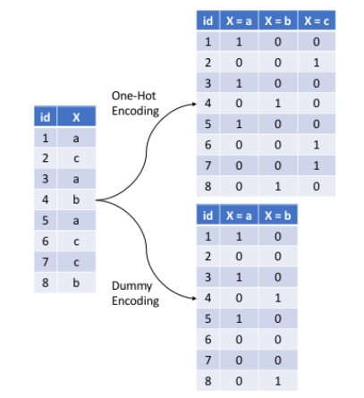 -->
<!-- ``` -->


<!-- ## One-hot/dummy Encoding Categorical Predictors -->

<!-- ```{r} -->
<!-- blueprint <- ames_recipe %>%  -->
<!--   step_nzv(Street, Utilities, Pool_Area, Screen_Porch, Misc_Val) %>%  # filter out zv/nzv predictors -->
<!--   step_impute_mean(Gr_Liv_Area) %>%                                   # impute missing entries -->
<!--   step_integer(Overall_Qual) %>%                                      # numeric conversion of levels of the predictors -->
<!--   step_center(all_numeric(), -all_outcomes()) %>%                     # center (subtract mean) all numeric predictors -->
<!--   step_scale(all_numeric(), -all_outcomes()) %>%                      # scale (divide by standard deviation) all numeric predictors -->
<!--   step_other(Neighborhood, threshold = 0.01, other = "other") %>%     # lumping required predictors -->
<!--   step_dummy(all_nominal(), one_hot = FALSE)                          # one-hot/dummy encode nominal categorical predictors -->
<!-- ``` -->


<!-- ## Preprocessing Steps -->

<!-- A suggested order of potential steps that should work for most problems: -->

<!-- 1. Filter out zero or near-zero variance features. -->

<!-- 2. Perform imputation if required. -->

<!-- 3. Label encode ordinal categorical features. -->

<!-- 4. Normalize/Standardize (center and scale) numeric features. -->

<!-- 5. Lump certain features if required. -->

<!-- 6. One-hot or dummy encode categorical features. -->


<!-- ## Data Leakage (A Serious, Common Problem) -->

<!-- Data leakage is when information from outside the training data set is used to create the model. Data leakage often occurs when the data preprocessing task is implemented with CV. To minimize this, feature engineering should be done in isolation of each resampling iteration. -->


<!-- ## Data Leakage (Example) {.smaller} -->

<!-- **KNN Classification: Toy Example** -->

<!-- <center> -->
<!-- | Obs. | $X_1$ | $X_2$ | Y | -->
<!-- |------|-------|-------|-------| -->
<!-- | 1 | 1033 | 1.7 | Red | -->
<!-- | 2 | 1112 | 1.5 | Red | -->
<!-- | 3 | 1500 | 1 | Red | -->
<!-- | 4 | 999 | 1 | Green | -->
<!-- | 5 | 1012 | 1.5 | Green | -->
<!-- | 6 | 1013 | 1 | Red | -->
<!-- | 7 | 1233 | 1 | Green | -->
<!-- | 8 | 1332 | 1 | Red | -->
<!-- </center> -->
<!-- \ -->


<!-- Suppose you implement 4-fold CV. Let's say the folds are randomly chosen to be observation pairs (2, 3), (4, 7), (1, 8), and (5, 6). -->


<!-- ## Preprocessing With `recipes` Package -->

<!-- There are three main steps in creating and applying feature engineering with `recipes`: -->

<!-- * **recipe:** where you define your feature engineering steps to create your blueprint -->

<!-- * **prepare:** estimate feature engineering parameters based on training data -->

<!-- * **bake:** apply the blueprint to data -->


<!-- ## Preprocessing With `recipes` Package -->

<!-- ```{r} -->
<!-- # finally, after all preprocessing steps have been decided set up the overall blueprint -->

<!-- ames_recipe <- recipe(Sale_Price ~ ., data = ames_train) -->

<!-- blueprint <- ames_recipe %>%     -->
<!--   step_nzv(Street, Utilities, Pool_Area, Screen_Porch, Misc_Val) %>%  -->
<!--   step_impute_mean(Gr_Liv_Area) %>% -->
<!--   step_integer(Overall_Qual) %>% -->
<!--   step_center(all_numeric(), -all_outcomes()) %>% -->
<!--   step_scale(all_numeric(), -all_outcomes()) %>% -->
<!--   step_other(Neighborhood, threshold = 0.01, other = "other") %>% -->
<!--   step_dummy(all_nominal(), one_hot = FALSE) -->


<!-- prepare <- prep(blueprint, data = ames_train)    # estimate feature engineering parameters based on training data -->


<!-- baked_train <- bake(prepare, new_data = ames_train)   # apply the blueprint to training data for building final/optimal model -->

<!-- baked_test <- bake(prepare, new_data = ames_test)    # apply the blueprint to test data for future use -->
<!-- ``` -->


<!-- ## Training Model  {.smaller} -->

<!-- * **A KNN model** -->

<!-- ```{r} -->
<!-- # perform CV to tune K -->

<!-- set.seed(042324) -->

<!-- cv_specs <- trainControl(method = "cv", number = 5)   # 5-fold CV (1 repeat) -->

<!-- k_grid <- expand.grid(k = seq(1, 10, by = 2)) -->

<!-- knn_fit <- train(blueprint, -->
<!--                   data = ames_train,  -->
<!--                   method = "knn", -->
<!--                   trControl = cv_specs, -->
<!--                   tuneGrid = k_grid, -->
<!--                   metric = "RMSE") -->

<!-- knn_fit -->
<!-- ``` -->


<!-- ## Training Model  {.smaller} -->

<!-- * **A KNN model** -->

<!-- ```{r, fig.align='center', fig.height=6, fig.width=8} -->
<!-- ggplot(knn_fit) -->
<!-- ``` -->


<!-- ## Training Model  {.smaller} -->

<!-- * **A linear regression model** -->

<!-- ```{r} -->
<!-- set.seed(042324) -->

<!-- lm_fit <- train(blueprint, -->
<!--                   data = ames_train,  -->
<!--                   method = "lm", -->
<!--                   trControl = cv_specs, -->
<!--                   metric = "RMSE") -->

<!-- lm_fit -->
<!-- ``` -->


<!-- ## Final Model and Test Set Error -->

<!-- ```{r} -->
<!-- # refit the final/optimal model using ALL modified training data, and obtain estimate of prediction error from modified test data -->

<!-- final_model <- lm(Sale_Price ~ ., data = baked_train)    # build final model  -->

<!-- final_preds <- predict(final_model, newdata = baked_test)   # obtain predictions on test data -->

<!-- sqrt(mean((baked_test$Sale_Price - final_preds)^2))    # calculate test set RMSE -->
<!-- ``` -->


<!-- ## Variable Importance  -->

<!-- ```{r, fig.align='center', fig.height=6, fig.width=8} -->
<!-- # variable importance -->

<!-- library(vip) -->

<!-- vip(object = lm_fit,         # CV object  -->
<!--     num_features = 20,   # maximum number of predictors to show importance for -->
<!--     method = "model")            # model-specific VI scores -->
<!-- ``` -->


<!-- ## <span style="color:blue">Your Turn!!!</span> {.smaller} -->

<!-- You will work with a dataset containing information on employee attrition. Please load the dataset using the code below. -->

<!-- ```{r} -->
<!-- attrition <- readRDS("attrition.rds") -->
<!-- ``` -->


<!-- **Objective**: The task is to predict `Attrition` (Yes/No) using the rest of the variables in the data (predictors/features). -->


<!-- * **Step 1**: Investigate the dataset -->

<!--     - What are the types of features? - categorical or numeric -->

<!--     - If categorical, are they ordinal or nominal? If ordinal, are their levels in appropriate order? You can use the `levels` function to check the ordering. -->

<!--     - Are there any features with missing entries? -->

<!--     - Are there any zv/nzv features? -->

<!-- * **Step 2**: Split the data into training and test sets (70-30 split) -->

<!-- * **Step 3**: Perform required data preprocessing and create the blueprint. If using `step_dummy()`, set `one_hot = FALSE`. -->

<!-- * **Step 4**: Implement 5-fold CV (1 repeat) to compare the performance of the following models. Use `metric = "Accuracy"`. -->

<!--     - a logistic regression model (`method = "glm"` and `family = "binomial"`) -->

<!--     - a KNN classifier with the optimal `K` chosen by CV (`method = "knn"`). Use a grid of `K` values $1, 2, \ldots, 10$. -->

<!-- What is the optimal `K` chosen? How do the models compare in terms of the CV accuracies? -->

<!-- * **Step 5**: Build your final optimal model. Obtain probability and class label predictions for the test set (use threshold of 0.5). Create the corresponding confusion matrix and report the test set accuracy. Also, create the ROC curve for the optimal model and report the AUC. -->


## Tree-Based Methods

* Involves **stratifying** or **segmenting** the predictor space into a number of simple regions.

* The set of splitting rules used to segment the predictor space can be summarized in a tree, thus, the name **decision tree** methods.

* Can be used for both classification and regression.

* Tree-based methods are simple and useful for interpretation, however, not the best in terms of prediction accuracy.

* Methods such as **bagging**, **random forests**, and **boosting** grow multiple trees and then combine their results.

<!-- ## Regression Trees -->

<!-- **Hitters dataset** -->

<!-- ```{r,echo=FALSE} -->
<!-- data("Hitters") -->
<!-- Hitters=na.omit(Hitters) -->
<!-- head(Hitters) -->
<!-- ``` -->

<!-- ## Regression Trees -->

<!-- **Hitters dataset** -->

<!-- log(Salary) is color-coded from low (blue, green) to high (yellow, red). -->

<!-- ```{r , echo=FALSE,  fig.align='center', out.width = '60%'} -->
<!-- 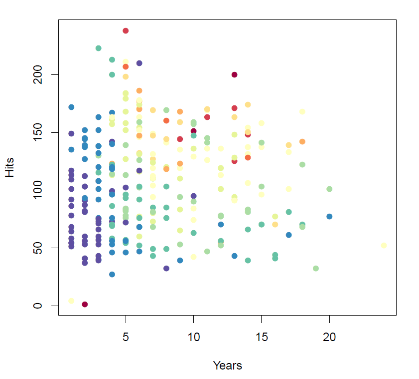 -->
<!-- ``` -->

<!-- ## Regression Trees -->

<!-- **Hitters dataset** -->

<!-- ```{r , echo=FALSE,  fig.align='center', out.width = '60%'} -->
<!-- 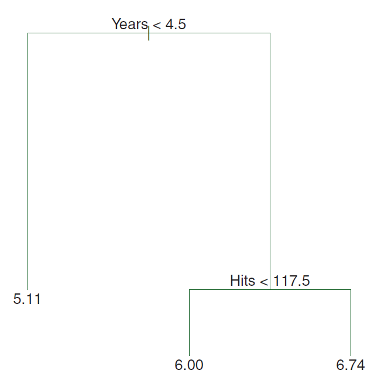 -->
<!-- ``` -->

<!-- ## Regression Trees -->

<!-- **Hitters dataset** -->

<!-- ```{r , echo=FALSE,  fig.align='center', out.width = '70%'} -->
<!-- 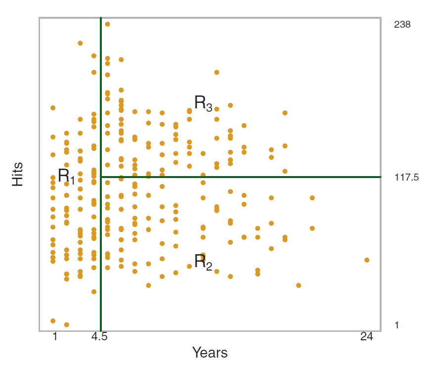 -->
<!-- ``` -->


## Terminology for Trees

* Every split is considered to be a **node**.

* We refer to the first node at the top of the tree as the **root node** (this node contains all of the training data). 

* The final nodes at the bottom of the tree are called the **terminal nodes** or **leaves**.

<!-- The regions $R_1$, $R_2$, and $R_3$ are known as **terminal nodes** or **leaves**. -->

* Decision trees are typically drawn **upside down**, in the sense that the leaves are at the bottom of the tree.

* The points along the tree where the predictor space is split are referred to as **internal nodes**, that is, every node in between the **root node** and **terminal nodes** is referred to as an **internal node**.

* The segments of the trees that connect the nodes are known as **branches**.


## Terminology for Trees

```{r , echo=FALSE,  fig.align='center', fig.cap="Adapted from HMLR, Boehmke & Greenwell", out.width = '100%'}
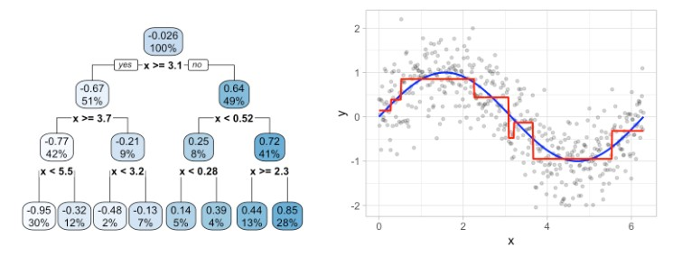
```


<!-- ## Interpretation of Trees -->

<!-- **Hitters dataset** -->

<!-- * **Years** is the most important factor in determining **Salary**, and players with less experience earn lower salaries than more experienced players. -->

<!-- * Given that a player is less experienced, the number of **Hits** that he made in the previous year seems to play little role in his **Salary**. -->

<!-- * But among players who have been in the major leagues for five or more years, the number of **Hits** made in the previous year does affect **Salary**, and players who made more **Hits** last year tend to have higher salaries. -->

<!-- * Surely an over-simplification, but compared to a regression model, it is easy to display, interpret and explain. -->


## Building a Tree

* First select the predictor $X_j$ and the cutpoint $s$ such that splitting the predictor space into the regions
$\{X|X_j < s\}$ and $\{X|X_j \ge s\}$ leads to the greatest possible reduction in $SSE$.

For any $j$ and $s$, define

$$R_1 = \{X|X_j < s\} \ \ \text{and} \ \ R_2 = \{X|X_j > s\}$$

<!-- ```{r , echo=FALSE,  fig.align='center', out.width = '67%'} -->
<!-- 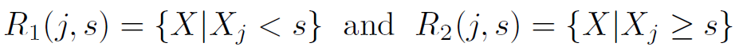 -->
<!-- ``` -->

Find $j$ and $s$ that minimize

$$SSE = \displaystyle \sum_{i \in R_1}\left(y_i - \hat{y}_{R_1}\right)^2 + \sum_{i \in R_2}\left(y_i - \hat{y}_{R_2}\right)^2$$

<!-- ```{r , echo=FALSE,  fig.align='center', out.width = '67%'} -->
<!-- 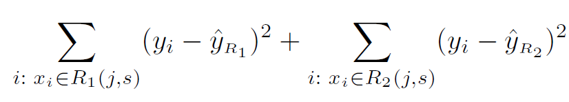 -->
<!-- ``` -->

* Next, repeat the process, look for the best predictor and best cutpoint in order to split the data further.
However, this time, instead of splitting the entire predictor space, split one of the two previously identified regions.

* The process continues until a stopping criterion is reached; say, we may continue until no region contains more than five observations.


## Prediction

<!-- Building a tree involves two steps. -->

<!-- The steps involved are: -->

<!-- 1. Dividing the predictor space, that is, the set of possible values for $X_1, X_2, \ldots, X_p$ into $J$ distinct and non-overlapping regions, $R_1, R_2, \ldots, R_J$. -->

For every observation that falls into the region $R_j$, make the same prediction, which is 

  * the mean response of the training set observations in $R_j$ (for regression problems), 
  
  * majority vote response of the training set observations in $R_j$ (for classification problems).


## Building a Tree and Prediction

```{r , echo=FALSE,  fig.align='center', fig.cap="Adapted from HMLR, Boehmke & Greenwell", out.width = '100%'}
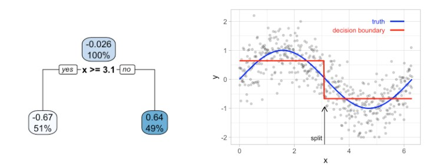
```


## Building a Tree and Prediction

```{r , echo=FALSE,  fig.align='center', fig.cap="Adapted from HMLR, Boehmke & Greenwell", out.width = '100%'}

```


## Building a Tree and Prediction

**Default Dataset**

```{r, fig.align='center', fig.height=6, fig.width=8, echo=FALSE}
library(ISLR2)

data("Default")

ggplot(data = Default) +
  geom_point(aes(x = balance, y = income, color = default), shape = c(3), alpha = 10)
```


## Building a Tree and Prediction

**Default Dataset**

```{r, fig.align='center', fig.height=6, fig.width=8, echo=FALSE}
library(rpart)
library(rpart.plot)
t <- rpart(default ~ balance + income, data = Default, method = "class")
rpart.plot(t)
```


## Building a Tree and Prediction

```{r , echo=FALSE,  fig.align='center', fig.cap="Adapted from ISLR, James et al.", out.width = '60%'}
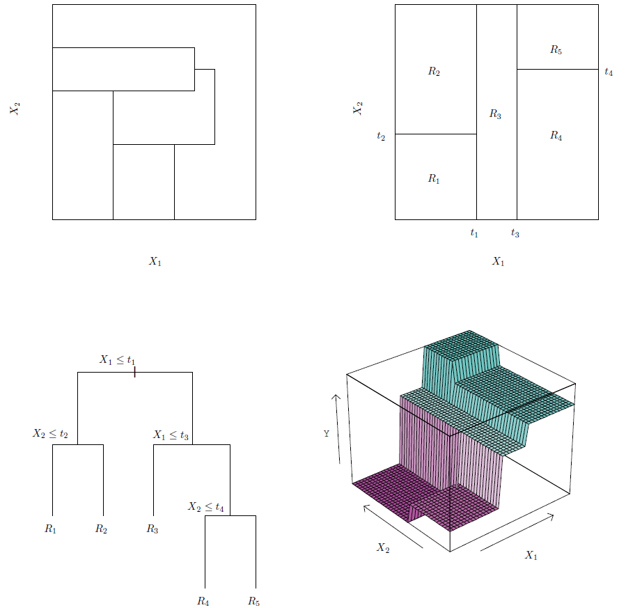
```


<!-- ## Building a Tree -->

<!-- * In theory, regions could have any shape. However, we -->
<!-- choose to divide the predictor space into **high-dimensional rectangles**, or **boxes**, for simplicity and for ease of interpretation of the resulting predictive model. -->

<!-- * **Objective**: Find boxes $R_1, R_2, \ldots R_J$ that minimize the $RSS$, -->

<!-- ```{r , echo=FALSE,  fig.align='center', out.width = '40%'} -->
<!-- 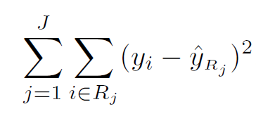 -->
<!-- ``` -->

<!-- where $\hat{y}_{R_j}$ is the mean response for the training observations within the $j^{th}$ box. -->


## Building a Tree

* It is computationally infeasible to consider every possible partition of the feature space into $J$ boxes.

* For this reason, we take a **top-down, greedy** approach known as **recursive binary splitting**.
    + **top-down** because it begins at the top of the tree and then successively splits the predictor space.
    + **greedy** because at each step of the tree-building process, the best split is made at that particular step, rather than looking ahead and picking a split that will lead to a better tree in some future step.


<!-- ## Building a Tree -->

<!-- ```{r , echo=FALSE,  fig.align='center', fig.cap="Adapted from HMLR, Boehmke & Greenwell", out.width = '100%'} -->
<!-- knitr::include_graphics("tree2.jpg") -->
<!-- ``` -->


## Tree Pruning

The process described above may **overfit** the data.

```{r , echo=FALSE,  fig.align='center', out.width = '70%'}
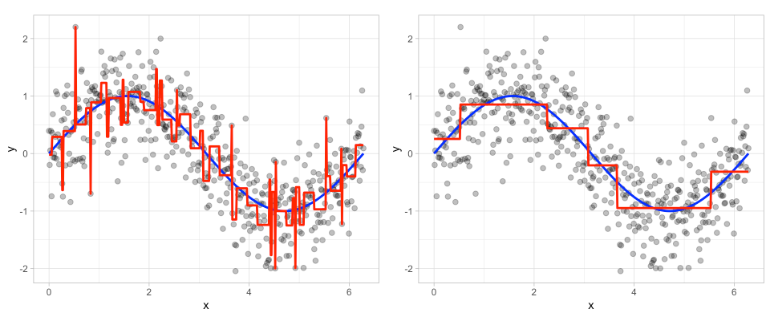
```


<!-- ## Tree Pruning -->

<!-- * The process described above may **overfit** the data. -->

<!-- * A smaller tree with fewer splits (that is, fewer regions $R_1,\ldots,R_J$) might lead to lower variance and better interpretation at the cost of a little bias. -->

<!-- * One possible alternative is to grow the tree only so long as the decrease in the $RSS$ due to each split exceeds some (high) threshold. -->

<!-- * This strategy will result in smaller trees, but is too short-sighted: a seemingly worthless split early on in the tree might be followed by a very good split, that is, a split that leads to a large reduction in $RSS$ later on. -->


## Tree Pruning

<!-- * A better strategy is **pruning**. -->

* Grow a very large tree, and then **prune** it back to obtain a **subtree**.

<!-- $T_0$ -->

* The technique uses is known as **cost complexity pruning** (also known as **weakest link pruning**).

* Consider a sequence of trees indexed by $\alpha$. For each $\alpha$, consider the tree that minimizes

$$SSE + \alpha \ |T|$$


<!-- $T \subset T_0$ -->

<!-- ```{r , echo=FALSE,  fig.align='center', out.width = '70%'} -->
<!-- 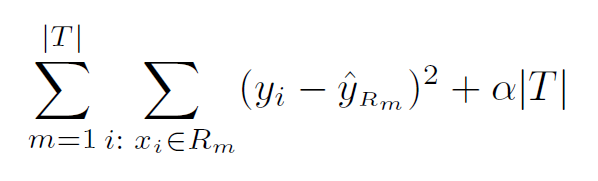 -->
<!-- ``` -->

* Choose optimal $\alpha$ by CV.


<!-- ## Building an Optimal Tree -->

<!-- ```{r , echo=FALSE,  fig.align='center', out.width = '90%'} -->
<!-- 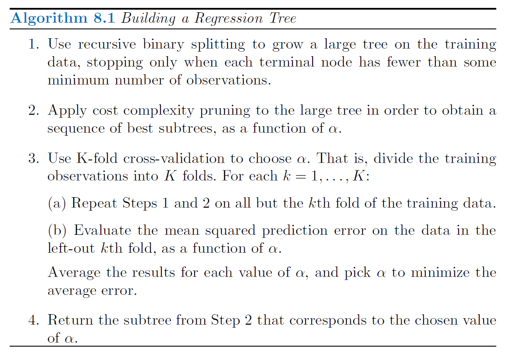 -->
<!-- ``` -->

<!-- ## Building an Optimal Tree -->

<!-- **Hitters dataset** -->

<!-- ```{r , echo=FALSE,  fig.align='center', out.width = '70%'} -->
<!-- 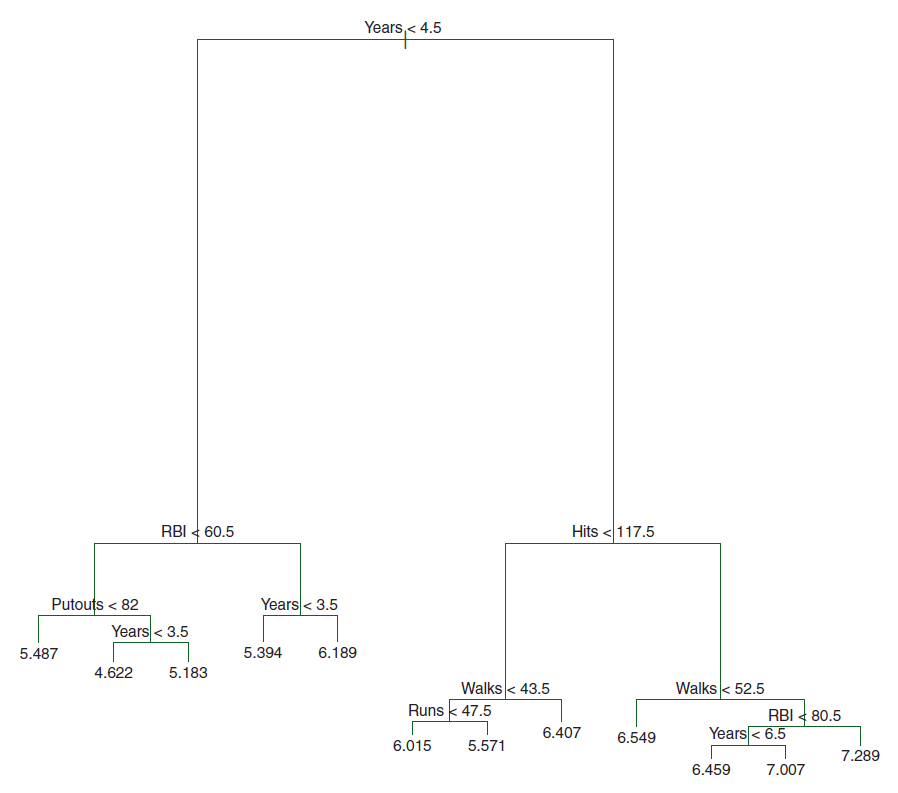 -->
<!-- ``` -->

<!-- ## Building an Optimal Tree -->

<!-- **Hitters dataset** -->

<!-- ```{r , echo=FALSE,  fig.align='center', out.width = '90%'} -->
<!-- 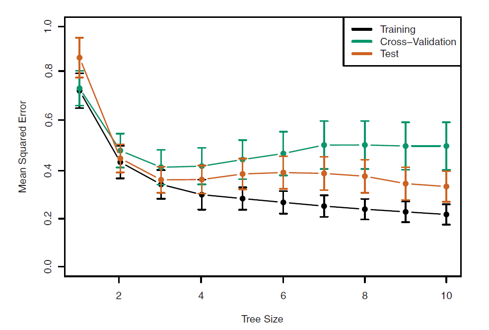 -->
<!-- ``` -->

<!-- ## Regression Tree: Implementation -->

<!-- **Ames Housing Dataset** -->

<!-- ```{r} -->
<!-- ames <- readRDS("AmesHousing.rds")   # load dataset -->
<!-- ``` -->

<!-- ```{r} -->
<!-- # reorder levels of 'Overall_Qual' -->
<!-- ames$Overall_Qual <- factor(ames$Overall_Qual, levels = c("Very_Poor", "Poor", "Fair", "Below_Average",  -->
<!--                                                           "Average", "Above_Average", "Good", "Very_Good",  -->
<!--                                                           "Excellent", "Very_Excellent")) -->
<!-- ``` -->

<!-- ```{r} -->
<!-- # split data -->

<!-- set.seed(050924)   # set seed -->

<!-- train_index <- createDataPartition(y = ames$Sale_Price, p = 0.7, list = FALSE)   # consider 70-30 split -->

<!-- ames_train <- ames[train_index,]   # training data -->

<!-- ames_test <- ames[-train_index,]   # test data -->
<!-- ``` -->


<!-- ## Regression Tree: Implementation -->

<!-- **Ames Housing Dataset** -->

<!-- ```{r} -->
<!-- # create recipe and blueprint, prepare and apply blueprint -->

<!-- set.seed(050924)   # set seed -->

<!-- ames_recipe <- recipe(Sale_Price ~ ., data = ames_train)   # set up recipe -->

<!-- blueprint <- ames_recipe %>% -->
<!--   step_nzv(Street, Utilities, Pool_Area, Screen_Porch, Misc_Val) %>%   # filter out zv/nzv predictors -->
<!--   step_impute_mean(Gr_Liv_Area) %>%                                    # impute missing entries -->
<!--   step_integer(Overall_Qual) %>%                                       # numeric conversion of levels of the predictors -->
<!--   step_center(all_numeric(), -all_outcomes()) %>%                      # center (subtract mean) all numeric predictors -->
<!--   step_scale(all_numeric(), -all_outcomes()) %>%                       # scale (divide by standard deviation) all numeric predictors -->
<!--   step_other(Neighborhood, threshold = 0.01, other = "other") %>%      # lumping required predictors -->
<!--   step_dummy(all_nominal(), one_hot = FALSE)                           # one-hot/dummy encode nominal categorical predictors -->


<!-- prepare <- prep(blueprint, data = ames_train)    # estimate feature engineering parameters based on training data -->


<!-- baked_train <- bake(prepare, new_data = ames_train)   # apply the blueprint to training data -->

<!-- baked_test <- bake(prepare, new_data = ames_test)    # apply the blueprint to test data -->
<!-- ``` -->


<!-- ## Regression Tree: Implementation -->

<!-- **Ames Housing Dataset** -->

<!-- Implement CV to tune the hyperparameter. -->

<!-- ```{r} -->
<!-- set.seed(050924)   # set seed -->

<!-- cv_specs <- trainControl(method = "repeatedcv", number = 5, repeats = 5)   # CV specifications -->


<!-- library(rpart)   # for trees -->

<!-- tree_cv <- train(blueprint, -->
<!--                  data = ames_train, -->
<!--                  method = "rpart",   -->
<!--                  trControl = cv_specs, -->
<!--                  tuneLength = 20,                   # considers a grid of 20 possible tuning parameter values -->
<!--                  metric = "RMSE") -->
<!-- ``` -->


<!-- ```{r} -->
<!-- # results from the CV procedure -->

<!-- tree_cv$bestTune    # optimal hyperparameter -->

<!-- min(tree_cv$results$RMSE)   # optimal CV RMSE -->
<!-- ``` -->


<!-- ## Regression Tree: Implementation {.smaller} -->

<!-- **Ames Housing Dataset** -->

<!-- Results from the CV procedure. -->

<!-- ```{r, fig.align='center', fig.height=6, fig.width=8} -->
<!-- ggplot(tree_cv)    -->
<!-- ``` -->


<!-- ## Regression Tree: Implementation -->

<!-- **Ames Housing Dataset** -->

<!-- ```{r} -->
<!-- # build final model -->

<!-- final_model <- rpart(formula = Sale_Price ~ ., -->
<!--                      data = baked_train, -->
<!--                      cp = tree_cv$bestTune$cp, -->
<!--                      xval = 0,                 # no further CV -->
<!--                      method = "anova")         # for regression -->
<!-- ``` -->


<!-- ```{r} -->
<!-- # obtain predictions and test set RMSE -->

<!-- final_model_preds <- predict(object = final_model, newdata = baked_test, type = "vector")    # obtain test set predictions -->

<!-- sqrt(mean((final_model_preds - baked_test$Sale_Price)^2))   # calculate test set RMSE -->
<!-- ``` -->


<!-- ## Regression Tree: Implementation  -->

<!-- **Ames Housing Dataset** -->

<!-- ```{r, fig.align='center', fig.height=6, fig.width=8} -->
<!-- library(rpart.plot) -->
<!-- rpart.plot(final_model)     -->
<!-- ``` -->


<!-- ## Regression Tree: Implementation {.smaller} -->

<!-- **Ames Housing Dataset** -->

<!-- ```{r, fig.align='center', fig.height=6, fig.width=8} -->
<!-- # variable importance -->

<!-- vip(object = tree_cv, num_features = 20, method = "model") -->
<!-- ``` -->


<!-- ## Regression Tree: Implementation -->

<!-- **Ames Housing Dataset** -->

<!-- ```{r} -->
<!-- # build full grown tree (no pruning) -->

<!-- final_model_no_prune <- rpart(formula = Sale_Price ~ ., -->
<!--                               data = baked_train, -->
<!--                               cp = 0,                   # no pruning -->
<!--                               xval = 0,                 # no CV -->
<!--                               method = "anova")         # for regression -->
<!-- ``` -->


<!-- ```{r} -->
<!-- # obtain predictions and test set RMSE -->

<!-- final_model_no_prune_preds <- predict(object = final_model_no_prune, newdata = baked_test, type = "vector")    # test set predictions -->

<!-- sqrt(mean((final_model_no_prune_preds - baked_test$Sale_Price)^2))   # calculate test set RMSE -->
<!-- ``` -->


<!-- ## Regression Tree: Implementation  -->

<!-- **Ames Housing Dataset** -->

<!-- ```{r, fig.align='center', fig.height=6, fig.width=8} -->
<!-- rpart.plot(final_model_no_prune)     -->
<!-- ``` -->


<!-- ## Regression Tree: Boston Data Example  {.smaller} -->


<!-- ```{r} -->
<!-- library(MASS) -->

<!-- data("Boston")   # load dataset -->

<!-- set.seed(05172022) -->

<!-- ## investigate dataset -->

<!-- str(Boston)  # check variable types -->
<!-- ``` -->


<!-- ## Regression Tree: Boston Data Example  {.smaller} -->

<!-- ```{r} -->
<!-- summary(Boston) -->
<!-- ``` -->

<!-- ## Regression Tree: Boston Data Example  {.smaller} -->


<!-- ```{r} -->
<!-- sum(is.na(Boston))   # check for missing values -->

<!-- nearZeroVar(Boston, saveMetrics = TRUE)   # check for zv/nzv features -->
<!-- ``` -->


<!-- ## Regression Tree: Boston Data Example   -->


<!-- ```{r} -->
<!-- # split the data into training and test sets -->

<!-- train_index <- createDataPartition(Boston$medv, p = 0.8, list = FALSE)   # 80-20 split -->

<!-- Boston_train <- Boston[train_index, ]   # training set -->

<!-- Boston_test <- Boston[-train_index, ]   # test set -->


<!-- # create feature preprocessing blueprint -->

<!-- blueprint <- recipe(medv ~ ., data = Boston_train) %>% -->
<!--   step_normalize(all_numeric_predictors()) -->

<!-- prepare <- prep(blueprint, training = Boston_train) -->

<!-- baked_train <- bake(prepare, new_data = Boston_train) -->

<!-- baked_test <- bake(prepare, new_data = Boston_test) -->
<!-- ``` -->


<!-- ## Regression Tree: Boston Data Example   -->


<!-- ```{r} -->
<!-- # implement CV -->

<!-- cv_specs <- trainControl(method = "repeatedcv", number = 5, repeats = 5) -->

<!-- tree_cv <- train(blueprint, -->
<!--                  data = Boston_train, -->
<!--                  method = "rpart", -->
<!--                  trControl = cv_specs, -->
<!--                  tuneLength = 20,     # considers a grid of 20 possible tuning parameter values -->
<!--                  metric = "RMSE") -->

<!-- tree_cv$bestTune   # optimal tuning parameter -->

<!-- min(tree_cv$results$RMSE)   # CV RMSE -->
<!-- ``` -->

<!-- ## Regression Tree: Boston Data Example   -->

<!-- ```{r} -->
<!-- tree_cv$finalModel$variable.importance   # importance of features -->
<!-- ``` -->


<!-- ## Regression Tree: Boston Data Example   -->


<!-- ```{r} -->
<!-- # fit final optimal model -->

<!-- tree_fit <- rpart(medv ~ ., -->
<!--                   data = baked_train, -->
<!--                   cp = tree_cv$bestTune$cp, -->
<!--                   xval = 0, -->
<!--                   method = "anova") -->


<!-- preds_tree <- predict(tree_fit, newdata = baked_test)   # obtain predictions on test set -->

<!-- sqrt(mean((preds_tree - baked_test$medv)^2))   # test RMSE -->
<!-- ``` -->

<!-- ## Regression Tree: Boston Data Example   -->


<!-- ```{r, fig.align='center'} -->
<!-- rpart.plot(tree_fit, cex = 0.75) -->
<!-- ``` -->


<!-- ## Regression Tree: Boston Data Example   -->


<!-- ```{r} -->
<!-- # fit full grown tree (with no pruning) for comparison -->

<!-- tree_fit1 <- rpart(medv ~ ., -->
<!--                    data = baked_train, -->
<!--                    cp = 0,  -->
<!--                    xval = 0, -->
<!--                    method = "anova") -->
<!-- ``` -->


<!-- ## Regression Tree: Boston Data Example   -->


<!-- ```{r, fig.align='center'} -->
<!-- rpart.plot(tree_fit1, cex = 0.75) -->
<!-- ``` -->


<!-- ## Classification Trees -->

<!-- * Very similar to a regression tree, except that it is used to predict a qualitative response rather than a quantitative one. -->

<!-- * For a classification tree, we predict that each observation belongs to the **most commonly occurring class** of training observations in the region to which it belongs. -->


<!-- * However, classification error is not sufficiently sensitive for tree-growing. -->

<!-- ## Classification Trees -->

<!-- * Another measure is the **Gini Index** -->

<!-- ```{r , echo=FALSE,  fig.align='center', out.width = '50%'} -->
<!-- 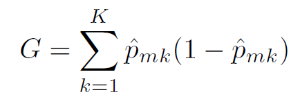 -->
<!-- ``` -->

<!-- measures the total variance across the $K$ classes. It is referred to as a measure of **node purity**. -->

<!-- * An alternative to the Gini index is **entropy** -->

<!-- ```{r , echo=FALSE,  fig.align='center', out.width = '50%'} -->
<!-- 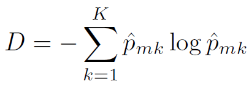 -->
<!-- ``` -->

<!-- ## Classification Trees -->

<!-- **Heart dataset** -->

<!-- ```{r, echo=FALSE} -->
<!-- Heart=read.csv("Heart.csv") -->
<!-- Heart$X=NULL -->
<!-- head(Heart) -->
<!-- ``` -->

<!-- ## Classification Trees -->

<!-- **Heart dataset** -->

<!-- ```{r , echo=FALSE,  fig.align='center', out.width = '100%'} -->
<!-- 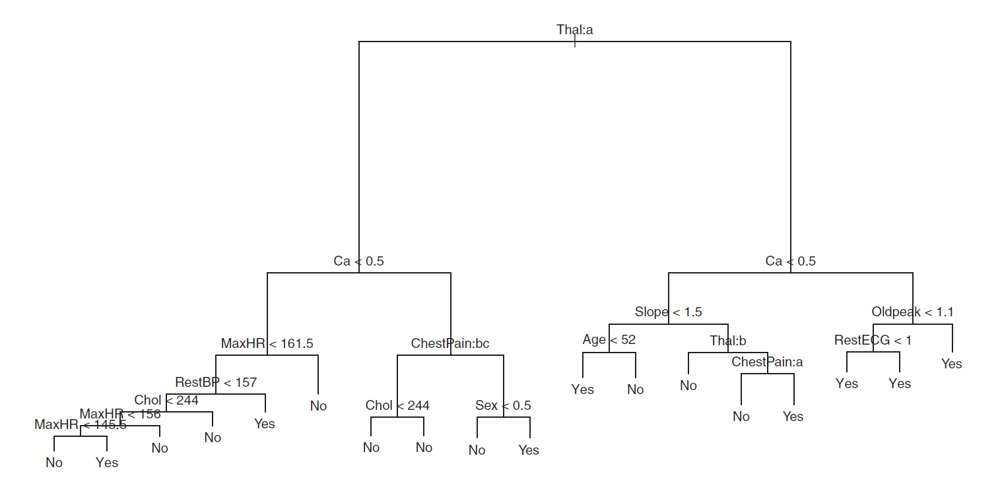 -->
<!-- ``` -->

<!-- ## Classification Trees -->

<!-- **Heart dataset** -->

<!-- ```{r , echo=FALSE,  fig.align='center', out.width = '100%'} -->
<!-- 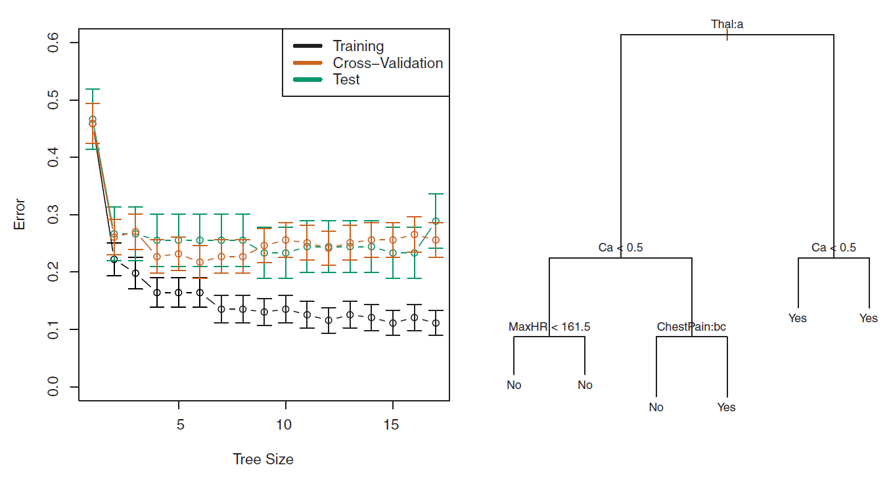 -->
<!-- ``` -->

<!-- ## Trees vs Linear Models -->

<!-- ```{r , echo=FALSE,  fig.align='center', out.width = '70%'} -->
<!-- 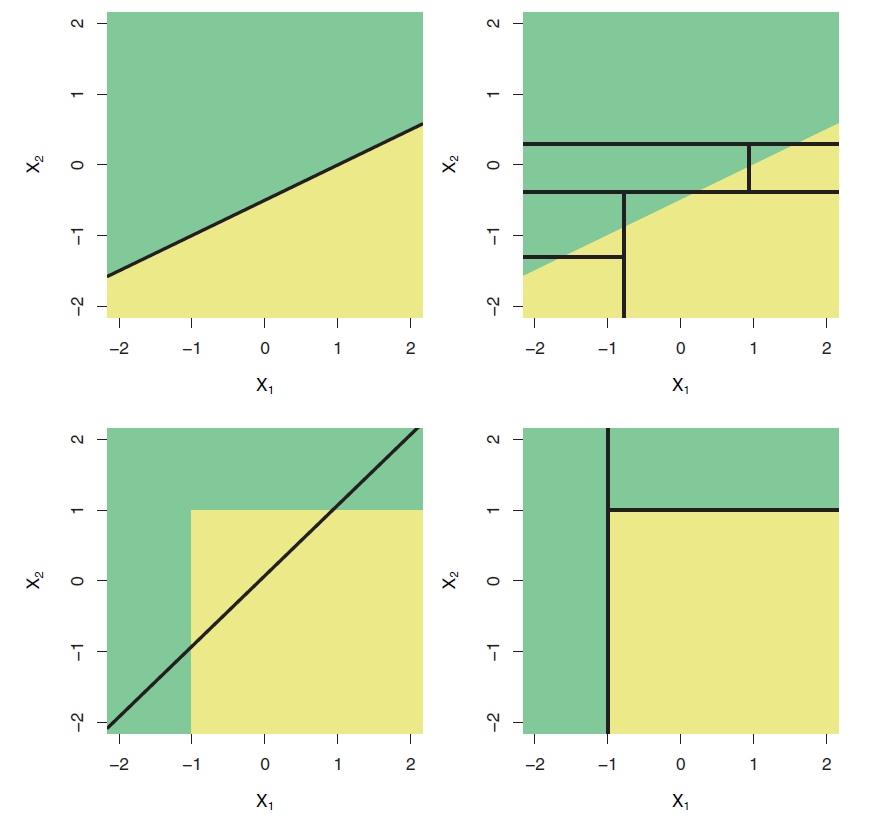 -->
<!-- ``` -->

## Classification Trees

* Still use **recursive binary splitting** to grow a classification tree.

* $SSE$ can be replaced by 

    - **classification error rate**, the fraction of the training observations in that region that do not belong to the most common class.
    
    $$E = 1 - \max_k \left(\hat{p}_{mk}\right)$$
    
  - **Gini index**,  a measure of node purity—a small value indicates that a node contains predominantly observations from a single class.
    
    
  $$G = \displaystyle \sum_{k=1}^{K} \hat{p}_{mk}\left(1-\hat{p}_{mk}\right)$$
    
    

<!-- ```{r , echo=FALSE,  fig.align='center', out.width = '50%'} -->
<!-- 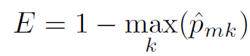 -->
<!-- ``` -->


Here $\hat{p}_{mk}$ represents the proportion of training observations in the $m^{th}$ region that are from the $k^{th}$ class.


## Trees

**Advantages**

* Easy to explain.

* Closely mirror human decision-making.

* Can be displayed graphically, and are easily interpreted by non-experts.

* Handle qualitative predictors without creating dummy variables. Does not require standardization of predictors.

**Disadvantages**

* Do not have same level of prediction accuracy.

* Can be very non-robust.


<!-- ## Regression Tree: Implementation -->

<!-- **Ames Housing Dataset** (minimal feature engineering) -->

<!-- ```{r} -->
<!-- # create new blueprint (minimal feature engineering), prepare and apply blueprint -->

<!-- set.seed(050924)   # set seed -->

<!-- ames_recipe <- recipe(Sale_Price ~ ., data = ames_train)   # set up recipe -->

<!-- blueprint_minimal <- ames_recipe %>% -->
<!--   step_impute_mean(Gr_Liv_Area)                                    # impute missing entries -->


<!-- prepare_minimal <- prep(blueprint_minimal, data = ames_train)    # estimate feature engineering parameters based on training data -->


<!-- baked_train_minimal <- bake(prepare_minimal, new_data = ames_train)   # apply the blueprint to training data -->

<!-- baked_test_minimal <- bake(prepare_minimal, new_data = ames_test)    # apply the blueprint to test data -->
<!-- ``` -->


<!-- ## Regression Tree: Implementation -->

<!-- **Ames Housing Dataset** -->

<!-- Implement CV to tune the hyperparameter. -->

<!-- ```{r} -->
<!-- set.seed(050924)   # set seed -->

<!-- cv_specs <- trainControl(method = "repeatedcv", number = 5, repeats = 5)   # CV specifications -->


<!-- tree_cv_min_fe <- train(blueprint_minimal, -->
<!--                         data = ames_train, -->
<!--                         method = "rpart",   -->
<!--                         trControl = cv_specs, -->
<!--                         tuneLength = 20,                   # considers a grid of 20 possible tuning parameter values -->
<!--                         metric = "RMSE") -->
<!-- ``` -->


<!-- ```{r} -->
<!-- # results from the CV procedure -->

<!-- tree_cv_min_fe$bestTune    # optimal hyperparameter -->

<!-- min(tree_cv_min_fe$results$RMSE)   # optimal CV RMSE -->

<!-- # doing feature engineering seems to result in a slightly better performance -->
<!-- ``` -->


<!-- ## Regression Tree: Implementation -->

<!-- **Ames Housing Dataset** -->

<!-- ```{r} -->
<!-- # build final model -->

<!-- final_model_min_fe <- rpart(formula = Sale_Price ~ ., -->
<!--                             data = baked_train_new, -->
<!--                             cp = tree_cv_min_fe$bestTune$cp, -->
<!--                             xval = 0,                 # no CV -->
<!--                             method = "anova")         # for regression -->
<!-- ``` -->


<!-- ```{r} -->
<!-- # obtain predictions and test set RMSE -->

<!-- final_model_min_fe_preds <- predict(final_model_min_fe, newdata = baked_test_new)    # obtain test set predictions -->

<!-- sqrt(mean((final_model_min_fe_preds - baked_test_new$Sale_Price)^2))   # calculate test set RMSE -->
<!-- ``` -->


<!-- ## Regression Tree: Implementation -->

<!-- **Ames Housing Dataset** -->


<!-- ```{r, fig.align='center', fig.height=6, fig.width=8} -->
<!-- # variable importance -->

<!-- vip(object = tree_cv_min_fe, num_features = 20, method = "model")           -->
<!-- ``` -->


<!-- ## <span style="color:blue">Your Turn!!!</span> {.smaller} -->

<!-- You will work with the `iris` dataset which contains measurements in centimeters of four variables for 50 flowers from each of 3 species of iris: setosa, versicolor, and virginica. Please load the dataset using the following code.  -->

<!-- ```{r} -->
<!-- data(iris)    # load dataset -->
<!-- ``` -->

<!-- We are interested in predicting `Species` using the rest of the variables in the dataset. Compare the performance (in terms of **Accuracy**) of the following models: -->

<!-- * A logistic regression model; -->

<!-- * A $K$-NN model with optimal $K$ chosen by CV; -->

<!-- * A classification tree with optimal hyperparameter chosen by CV. Use `tuneLength = 20`. -->

<!-- * A classification tree with minimal feature engineering. Use CV to choose the optimal hyperparameter. Use `tuneLength = 20`. -->


<!-- **Perform the following tasks.** -->

<!-- * Investigate the dataset and complete any necessary tasks.  -->

<!-- * Split the data into training and test sets (75-25). -->

<!-- * Perform required data preprocessing and create the blueprint. If using `step_dummy()`, set `one_hot = FALSE`. Prepare the blueprint on the training data. Obtain the modified training and test datasets.  -->

<!-- * Implement 10-fold CV repeated 5 times for each of the models above.  -->

<!-- * Report the optimal CV Accuracy of each model. Report the optimal hyperparameters for each model. Which model performs best in this situation?  -->

<!-- * Build the final model. Obtain class label predictions on the test set. Create the corresponding confusion matrix and report the test set accuracy. Based on your optimal final model, consult the help page for either `predict.knn3` or `predict.rpart` functions. -->

<!-- ## <span style="color:blue">Your Turn!!!</span> {.smaller} -->

<!-- ```{r} -->
<!-- glimpse(iris)   # all features are numerical -->
<!-- ``` -->

<!-- ```{r} -->
<!-- summary(iris)   # summary of variables -->
<!-- ``` -->

<!-- ```{r} -->
<!-- sum(is.na(iris))  # no missing entries -->
<!-- ``` -->


<!-- ## <span style="color:blue">Your Turn!!!</span> -->

<!-- ```{r} -->
<!-- set.seed(050924)   # set seed -->

<!-- # split the data into training and test sets -->

<!-- index <- createDataPartition(iris$Species, p = 0.75, list = FALSE) -->

<!-- iris_train <- iris[index, ] -->

<!-- iris_test <- iris[-index, ] -->
<!-- ``` -->


<!-- ```{r} -->
<!-- nearZeroVar(iris_train, saveMetrics = TRUE)  # no zv/nzv features -->
<!-- ``` -->


<!-- ## <span style="color:blue">Your Turn!!!</span> -->

<!-- ```{r} -->
<!-- set.seed(050924)   # set seed -->

<!-- # create recipe and blueprint, prepare and apply blueprint -->

<!-- blueprint <- recipe(Species ~ ., data = iris_train) %>% -->
<!--   step_normalize(all_predictors())               # center and scale numeric predictors, in this case, all predictors -->

<!-- prepare <- prep(blueprint, training = iris_train) -->

<!-- baked_train <- bake(prepare, new_data = iris_train) -->

<!-- baked_test <- bake(prepare, new_data = iris_test) -->
<!-- ``` -->


<!-- ## <span style="color:blue">Your Turn!!!</span> -->

<!-- ```{r} -->
<!-- set.seed(050924)   # set seed -->

<!-- cv_specs <- trainControl(method = "repeatedcv", number = 10, repeats = 5)   # CV specifications -->
<!-- ``` -->

<!-- ```{r, eval = FALSE} -->
<!-- logistic_cv <- train(blueprint, -->
<!--                      data = iris_train, -->
<!--                      method = "glm", -->
<!--                      family = "binomial", -->
<!--                      trControl = cv_specs, -->
<!--                      metric = "Accuracy") -->

<!-- # The code above will throw an error since this is a 3-class classification problem and -->
<!-- # logistic regression (with family = binomial) works for a binary (2-class) problem. -->
<!-- ``` -->


<!-- ## <span style="color:blue">Your Turn!!!</span> -->

<!-- ```{r} -->
<!-- set.seed(050924)   # set seed -->

<!-- # CV for KNN -->
<!-- k_grid <- expand.grid(k = seq(1, 101, by = 10)) -->

<!-- knn_cv <- train(blueprint, -->
<!--                 data = iris_train, -->
<!--                 method = "knn", -->
<!--                 trControl = cv_specs, -->
<!--                 tuneGrid = k_grid, -->
<!--                 metric = "Accuracy") -->


<!-- # CV with tree -->
<!-- tree_cv <- train(blueprint, -->
<!--                  data = iris_train, -->
<!--                  method = "rpart", -->
<!--                  trControl = cv_specs, -->
<!--                  tuneLength = 20, -->
<!--                  metric = "Accuracy") -->


<!-- # CV with tree (minimal feature engineering, no engineering in this case) -->
<!-- tree_cv_min_fe <- train(Species ~ ., -->
<!--                         data = iris_train, -->
<!--                         method = "rpart", -->
<!--                         trControl = cv_specs, -->
<!--                         tuneLength = 20, -->
<!--                         metric = "Accuracy") -->
<!-- ``` -->


<!-- ## <span style="color:blue">Your Turn!!!</span> -->

<!-- ```{r} -->
<!-- # optimal CV Accuracies -->

<!-- max(knn_cv$results$Accuracy)     # for KNN -->

<!-- max(tree_cv$results$Accuracy)     # for classification tree -->

<!-- max(tree_cv_min_fe$results$Accuracy)     # for classification tree with minimal feature engineering -->
<!-- ``` -->


<!-- ## <span style="color:blue">Your Turn!!!</span> -->

<!-- ```{r} -->
<!-- # optimal hyperparameters -->

<!-- knn_cv$bestTune$k    # for KNN -->

<!-- tree_cv$bestTune$cp    # for classification tree -->

<!-- tree_cv_min_fe$bestTune$cp    # for classification tree with minimal feature engineering -->
<!-- ``` -->


<!-- ## <span style="color:blue">Your Turn!!!</span> {.smaller} -->

<!-- ```{r} -->
<!-- # final model -->

<!-- final_model <- knn3(Species ~ ., data = baked_train, k = knn_cv$bestTune$k) -->
<!-- ``` -->

<!-- ```{r} -->
<!-- # obtain probability and class label predictions -->

<!-- final_model_prob_preds <- predict(final_model, newdata = baked_test, type = "prob")   # probability predictions -->

<!-- final_model_class_preds <- predict(final_model, newdata = baked_test, type = "class")   # class label predictions -->

<!-- confusionMatrix(data = final_model_class_preds, reference = baked_test$Species) -->
<!-- ``` -->


