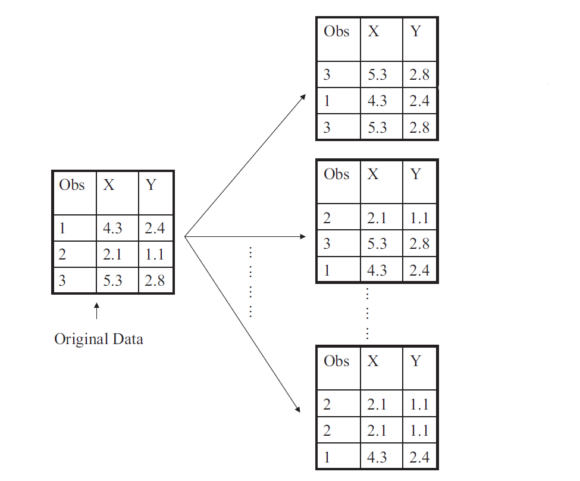
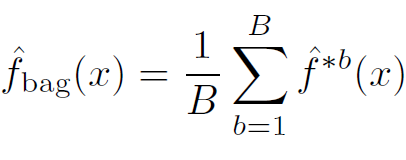
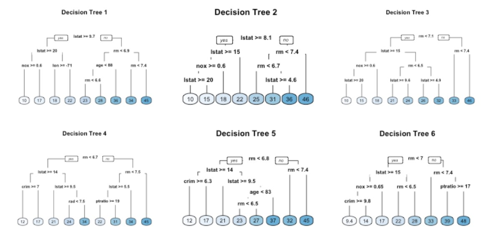

```{r setup, include=FALSE}
knitr::opts_chunk$set(echo = TRUE, warning = FALSE, message = FALSE)
```

```{r, include=FALSE}
library(tidyverse)
# library(ggformula)
library(gridExtra)
# library(ISLR2)
# library(knitr)
# library(MASS)
library(caret)
# library(pROC)
library(recipes)
library(vip)
library(rpart)
library(rpart.plot)
```

<style>
  .col2 {
    columns: 2 200px;         /* number of columns and width in pixels*/
    -webkit-columns: 2 200px; /* chrome, safari */
    -moz-columns: 2 200px;    /* firefox */
  }
  .col3 {
    columns: 3 100px;
    -webkit-columns: 3 100px;
    -moz-columns: 3 100px;
  }
</style>


## Single Decision Trees

**Advantages**

* Easy to explain.

* Closely mirror human decision-making.

* Can be displayed graphically, and are easily interpreted by non-experts.

* Handle qualitative predictors without creating dummy variables. Does not require standardization of predictors.

**Disadvantages**

* Do not have same level of prediction accuracy.

* Can be very non-robust.


<!-- ## Regression Tree: Implementation -->

<!-- **Ames Housing Dataset** (minimal feature engineering) -->

<!-- ```{r} -->
<!-- # create new blueprint (minimal feature engineering), prepare and apply blueprint -->

<!-- set.seed(050924)   # set seed -->

<!-- ames_recipe <- recipe(Sale_Price ~ ., data = ames_train)   # set up recipe -->

<!-- blueprint_minimal <- ames_recipe |> -->
<!--   step_impute_mean(Gr_Liv_Area)                                    # impute missing entries -->


<!-- prepare_minimal <- prep(blueprint_minimal, data = ames_train)    # estimate feature engineering parameters based on training data -->


<!-- baked_train_minimal <- bake(prepare_minimal, new_data = ames_train)   # apply the blueprint to training data -->

<!-- baked_test_minimal <- bake(prepare_minimal, new_data = ames_test)    # apply the blueprint to test data -->
<!-- ``` -->


<!-- ## Regression Tree: Implementation -->

<!-- **Ames Housing Dataset** -->

<!-- Implement CV to tune the hyperparameter. -->

<!-- ```{r} -->
<!-- set.seed(050924)   # set seed -->

<!-- cv_specs <- trainControl(method = "repeatedcv", number = 5, repeats = 5)   # CV specifications -->


<!-- tree_cv_min_fe <- train(blueprint_minimal, -->
<!--                         data = ames_train, -->
<!--                         method = "rpart",   -->
<!--                         trControl = cv_specs, -->
<!--                         tuneLength = 20,                   # considers a grid of 20 possible tuning parameter values -->
<!--                         metric = "RMSE") -->
<!-- ``` -->


<!-- ```{r} -->
<!-- # results from the CV procedure -->

<!-- tree_cv_min_fe$bestTune    # optimal hyperparameter -->

<!-- min(tree_cv_min_fe$results$RMSE)   # optimal CV RMSE -->

<!-- # doing feature engineering seems to result in a slightly better performance -->
<!-- ``` -->


<!-- ## Regression Tree: Implementation -->

<!-- **Ames Housing Dataset** -->

<!-- ```{r} -->
<!-- # build final model -->

<!-- final_model_min_fe <- rpart(formula = Sale_Price ~ ., -->
<!--                             data = baked_train_new, -->
<!--                             cp = tree_cv_min_fe$bestTune$cp, -->
<!--                             xval = 0,                 # no CV -->
<!--                             method = "anova")         # for regression -->
<!-- ``` -->


<!-- ```{r} -->
<!-- # obtain predictions and test set RMSE -->

<!-- final_model_min_fe_preds <- predict(final_model_min_fe, newdata = baked_test_new)    # obtain test set predictions -->

<!-- sqrt(mean((final_model_min_fe_preds - baked_test_new$Sale_Price)^2))   # calculate test set RMSE -->
<!-- ``` -->


<!-- ## Regression Tree: Implementation -->

<!-- **Ames Housing Dataset** -->


<!-- ```{r, fig.align='center', fig.height=6, fig.width=8} -->
<!-- # variable importance -->

<!-- vip(object = tree_cv_min_fe, num_features = 20, method = "model")           -->
<!-- ``` -->


<!-- ## <span style="color:blue">Your Turn!!!</span> {.smaller} -->

<!-- You will work with the `iris` dataset which contains measurements in centimeters of four variables for 50 flowers from each of 3 species of iris: setosa, versicolor, and virginica. Please load the dataset using the following code.  -->

<!-- ```{r} -->
<!-- data(iris)    # load dataset -->
<!-- ``` -->

<!-- We are interested in predicting `Species` using the rest of the variables in the dataset. Compare the performance (in terms of **Accuracy**) of the following models: -->

<!-- * A logistic regression model; -->

<!-- * A $K$-NN model with optimal $K$ chosen by CV; -->

<!-- * A classification tree with optimal hyperparameter chosen by CV. Use `tuneLength = 20`. -->

<!-- * A classification tree with minimal feature engineering. Use CV to choose the optimal hyperparameter. Use `tuneLength = 20`. -->


<!-- **Perform the following tasks.** -->

<!-- * Investigate the dataset and complete any necessary tasks.  -->

<!-- * Split the data into training and test sets (75-25). -->

<!-- * Perform required data preprocessing and create the blueprint. If using `step_dummy()`, set `one_hot = FALSE`. Prepare the blueprint on the training data. Obtain the modified training and test datasets.  -->

<!-- * Implement 10-fold CV repeated 5 times for each of the models above.  -->

<!-- * Report the optimal CV Accuracy of each model. Report the optimal hyperparameters for each model. Which model performs best in this situation?  -->

<!-- * Build the final model. Obtain class label predictions on the test set. Create the corresponding confusion matrix and report the test set accuracy. Based on your optimal final model, consult the help page for either `predict.knn3` or `predict.rpart` functions. -->

<!-- ## <span style="color:blue">Your Turn!!!</span> {.smaller} -->

<!-- ```{r} -->
<!-- glimpse(iris)   # all features are numerical -->
<!-- ``` -->

<!-- ```{r} -->
<!-- summary(iris)   # summary of variables -->
<!-- ``` -->

<!-- ```{r} -->
<!-- sum(is.na(iris))  # no missing entries -->
<!-- ``` -->


<!-- ## <span style="color:blue">Your Turn!!!</span> -->

<!-- ```{r} -->
<!-- set.seed(050924)   # set seed -->

<!-- # split the data into training and test sets -->

<!-- index <- createDataPartition(iris$Species, p = 0.75, list = FALSE) -->

<!-- iris_train <- iris[index, ] -->

<!-- iris_test <- iris[-index, ] -->
<!-- ``` -->


<!-- ```{r} -->
<!-- nearZeroVar(iris_train, saveMetrics = TRUE)  # no zv/nzv features -->
<!-- ``` -->


<!-- ## <span style="color:blue">Your Turn!!!</span> -->

<!-- ```{r} -->
<!-- set.seed(050924)   # set seed -->

<!-- # create recipe and blueprint, prepare and apply blueprint -->

<!-- blueprint <- recipe(Species ~ ., data = iris_train) |> -->
<!--   step_normalize(all_predictors())               # center and scale numeric predictors, in this case, all predictors -->

<!-- prepare <- prep(blueprint, training = iris_train) -->

<!-- baked_train <- bake(prepare, new_data = iris_train) -->

<!-- baked_test <- bake(prepare, new_data = iris_test) -->
<!-- ``` -->


<!-- ## <span style="color:blue">Your Turn!!!</span> -->

<!-- ```{r} -->
<!-- set.seed(050924)   # set seed -->

<!-- cv_specs <- trainControl(method = "repeatedcv", number = 10, repeats = 5)   # CV specifications -->
<!-- ``` -->

<!-- ```{r, eval = FALSE} -->
<!-- logistic_cv <- train(blueprint, -->
<!--                      data = iris_train, -->
<!--                      method = "glm", -->
<!--                      family = "binomial", -->
<!--                      trControl = cv_specs, -->
<!--                      metric = "Accuracy") -->

<!-- # The code above will throw an error since this is a 3-class classification problem and -->
<!-- # logistic regression (with family = binomial) works for a binary (2-class) problem. -->
<!-- ``` -->


<!-- ## <span style="color:blue">Your Turn!!!</span> -->

<!-- ```{r} -->
<!-- set.seed(050924)   # set seed -->

<!-- # CV for KNN -->
<!-- k_grid <- expand.grid(k = seq(1, 101, by = 10)) -->

<!-- knn_cv <- train(blueprint, -->
<!--                 data = iris_train, -->
<!--                 method = "knn", -->
<!--                 trControl = cv_specs, -->
<!--                 tuneGrid = k_grid, -->
<!--                 metric = "Accuracy") -->


<!-- # CV with tree -->
<!-- tree_cv <- train(blueprint, -->
<!--                  data = iris_train, -->
<!--                  method = "rpart", -->
<!--                  trControl = cv_specs, -->
<!--                  tuneLength = 20, -->
<!--                  metric = "Accuracy") -->


<!-- # CV with tree (minimal feature engineering, no engineering in this case) -->
<!-- tree_cv_min_fe <- train(Species ~ ., -->
<!--                         data = iris_train, -->
<!--                         method = "rpart", -->
<!--                         trControl = cv_specs, -->
<!--                         tuneLength = 20, -->
<!--                         metric = "Accuracy") -->
<!-- ``` -->


<!-- ## <span style="color:blue">Your Turn!!!</span> -->

<!-- ```{r} -->
<!-- # optimal CV Accuracies -->

<!-- max(knn_cv$results$Accuracy)     # for KNN -->

<!-- max(tree_cv$results$Accuracy)     # for classification tree -->

<!-- max(tree_cv_min_fe$results$Accuracy)     # for classification tree with minimal feature engineering -->
<!-- ``` -->


<!-- ## <span style="color:blue">Your Turn!!!</span> -->

<!-- ```{r} -->
<!-- # optimal hyperparameters -->

<!-- knn_cv$bestTune$k    # for KNN -->

<!-- tree_cv$bestTune$cp    # for classification tree -->

<!-- tree_cv_min_fe$bestTune$cp    # for classification tree with minimal feature engineering -->
<!-- ``` -->


<!-- ## <span style="color:blue">Your Turn!!!</span> {.smaller} -->

<!-- ```{r} -->
<!-- # final model -->

<!-- final_model <- knn3(Species ~ ., data = baked_train, k = knn_cv$bestTune$k) -->
<!-- ``` -->

<!-- ```{r} -->
<!-- # obtain probability and class label predictions -->

<!-- final_model_prob_preds <- predict(final_model, newdata = baked_test, type = "prob")   # probability predictions -->

<!-- final_model_class_preds <- predict(final_model, newdata = baked_test, type = "class")   # class label predictions -->

<!-- confusionMatrix(data = final_model_class_preds, reference = baked_test$Species) -->
<!-- ``` -->


## Ensemble Methods {.smaller}

Single regression or classification trees usually have poor predictive performance.

**Ensemble Methods** use a collection of multiple trees to improve the predictive performance at the cost of interpretability. 

* Bagging

* Random Forests

* Boosting

```{r , echo=FALSE,  fig.cap="Adapted from ISLR, James et al.", fig.align='center', out.width = '70%'}
knitr::include_graphics("EFT/2.7.png")
```


## Bagging

* **Bootstrap aggregation** or **bagging** is a general-purpose procedure for reducing the variance of a statistical learning method.

* **Idea**: Build multiple trees and average their results.

* **Result**: Given a set of $n$ independent observations (random variables) $Z_1, \ldots, Z_n$, each with variance $\sigma^2$, the variance of the mean/average $\bar{Z} = \displaystyle \dfrac{Z_1 + Z_2 + \cdots + Z_n}{n}$ of the observations is $\sigma^2/n$.

In other words, **averaging a set of observations reduces variance**.

* In reality, we do not have multiple training datasets.


## Bagging

**Bootstrapping**

```{r , echo=FALSE, fig.cap="Adapted from ISLR, James et al.", fig.align='center', out.width = '70%'}

```

## Bagging

* Take repeated bootstrap samples (say $B$) from the original (single) available dataset.

* Build a tree on each bootstrap sample and obtain predictions $\hat{f}^{*b}(x), \ b=1, 2, \ldots, B$.

* Average all the predictions.

```{r , echo=FALSE,  fig.align='center', out.width = '40%'}

```

* Individual trees are grown deep and are not pruned. They have high variance, but low bias.

* For classification trees, take **majority vote**: the overall prediction is the most commonly occurring class among the $B$ predictions.


## Bagging: Disadvantages

* Bagging improves the prediction accuracy for high variance (and low bias) models at the expense of interpretability and computational speed.

* However, although the model building steps are independent, the trees in bagging are not completely independent of each other since all the original features are considered at every split of every tree. Rather, trees from different bootstrap samples typically have similar structure to each other (especially at the top of the tree) due to any underlying strong relationships.

* This characteristic is known as **tree correlation** and prevents bagging from further reducing the variance of the individual models. **Random forests** extend and improve upon bagged decision trees by reducing this correlation and thereby improving the accuracy of the overall ensemble.


## Bagging: Disadvantages

## Bagging: Disadvantages

**Tree Correlation in Bagging**

```{r , echo=FALSE,  fig.align='center', fig.cap="Adapted from HMLR, Boehmke & Greenwell", out.width = '100%'}

```


## Random Forests

* Provide an improvement over bagged trees by reducing the variance further (by **decorrelating**) when we average the trees.

* As in bagging, we build a number of decision trees on bootstrapped training samples.

* For each tree, each time a split is considered, a **random selection of $m$ predictors** is chosen (split candidates) from the full set of $p$ predictors. The split is allowed to use only one of those $m$ predictors. Note that in bagging, each split for each tree considers all $p$ predictors as split candidates.

* A fresh sample of $m$ predictors is taken at each split. Typical default values are $m = p/3$ (regression) and $m = \sqrt{p}$ (classification) but this should be considered a tuning parameter, to be chosen by CV.


## Gradient Boosting

Like bagging and random forests, boosting involves combining a large number of decision trees. However, the main idea of boosting is to add new models to the ensemble **sequentially**. 

Each model in the process is a weak model, referred to as the **base learner**. The idea behind boosting is that each model in the sequence slightly improves upon the performance of the previous one, thereby **learning slowly**.

At each step of the process, we fit a tree to the residuals from the previous model, rather than the outcome $Y$, as the response. The final model is a stagewise additive model of $B$ individual trees.

$$\hat{f}(x) = \displaystyle \sum_{b=1}^{B} \lambda \ \hat{f}^b(x)$$

The process is called **gradient boosting** since it uses the **gradient descent** algorithm to minimize the loss function.


## Gradient Boosting


## Gradient Boosting

```{r, echo=FALSE, fig.align='center', fig.height=6, fig.width=8}

# Simulate sine wave data
set.seed(1112)  # for reproducibility
df <- tibble::tibble(
  x = seq(from = 0, to = 2 * pi, length = 1000),
  y = sin(x) + rnorm(length(x), sd = 0.5),
  truth = sin(x)
)

# Function to boost `rpart::rpart()` trees
rpartBoost <- function(x, y, data, num_trees = 100, learn_rate = 0.1, tree_depth = 6) {
  x <- data[[deparse(substitute(x))]]
  y <- data[[deparse(substitute(y))]]
  G_b_hat <- matrix(0, nrow = length(y), ncol = num_trees + 1)
  r <- y
  for(tree in seq_len(num_trees)) {
    g_b_tilde <- rpart(r ~ x, control = list(cp = 0, maxdepth = tree_depth))
    g_b_hat <- learn_rate * predict(g_b_tilde)
    G_b_hat[, tree + 1] <- G_b_hat[, tree] + matrix(g_b_hat)
    r <- r - g_b_hat
    colnames(G_b_hat) <- paste0("tree_", c(0, seq_len(num_trees)))
  }
  cbind(df, as.data.frame(G_b_hat)) |>
    gather(tree, prediction, starts_with("tree")) |>
    mutate(tree = stringr::str_extract(tree, "\\d+") |> as.numeric())
}

# Plot boosted tree sequence
rpartBoost(x, y, data = df, num_trees = 2^10, learn_rate = 0.05, tree_depth = 1) |>
  filter(tree %in% c(0, 2^c(0:10))) |>
  ggplot(aes(x, prediction)) +
    ylab("y") +
    geom_point(data = df, aes(x, y), alpha = .1) +
    geom_line(data = df, aes(x, truth), color = "cyan") +
    geom_line(colour = "red", size = 1) +
    facet_wrap(~ tree, nrow = 3) +
    theme_bw()

```


## Gradient Boosting 

The hyperparameters (to be tuned by CV) include:

* **Number of trees**: Having too many trees can overfit the training data.
\
\

* **Shrinkage** ($\lambda$): Determines the contribution of each tree to the final model and controls how quickly the algorithm learns.
\
\

* **Tree Depth**: Controls the depth of the individual trees.  
\
\

* **Minimum number of observations in terminal nodes**: Also, controls the complexity of each tree.


